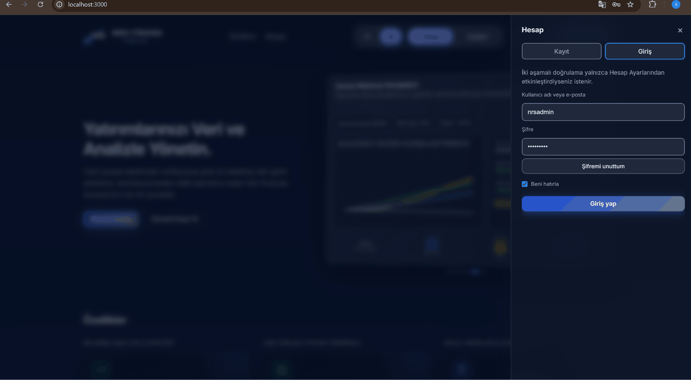

<p>
  
</p>

<p align="center">
  
</p>

<p align="center"><strong>Languages / Diller:</strong> <a href="README.md">English</a> · <a href="README.tr.md">Türkçe</a></p>

<h1 align="center">NRS Finance Portal</h1>

<p align="center">
  <strong>Multi-asset market intelligence, portfolio analytics, and investment simulation in one platform.</strong>
</p>

<p align="center">
  <a href="https://github.com/nurs3li/NrsFinancePortal/actions/workflows/ci.yml">
    
  </a>
  <a href="LICENSE">
    
  </a>
  
  
  
  
</p>

<p align="center">
  Modular finance platform for portfolio management, live markets, real-return analytics, simulations, alerts, and production-grade observability — delivered as <strong>4 Spring Boot microservices</strong> + <strong>1 React SPA</strong> on Docker Compose.
</p>

### Key capabilities

- **Multi-asset market terminal** — FX, crypto, equities, funds, VIOP, bonds
- **Portfolio analytics** — manual positions, inflation-adjusted returns, concentration
- **Investment simulation** — historical what-if scenarios
- **Identity & security** — Keycloak JWT, optional TOTP 2FA
- **Observability** — OpenTelemetry, Prometheus, Grafana, Tempo, centralized logs (Kafka → OpenSearch)
- **Open APIs** — SpringDoc OpenAPI / Swagger per service

<table>
  <tr>
    <td align="center" width="50%">
      
    </td>
    <td align="center" width="50%">
      
    </td>
  </tr>
  <tr>
    <td align="center" width="50%">
      
    </td>
    <td align="center" width="50%">
      
    </td>
  </tr>
</table>

---

## Contents

1. [Quick start](#quick-start)
2. [Product overview](#product-overview)
3. [Tech stack](#tech-stack)
4. [System architecture](#system-architecture)
5. [Getting started (Docker)](#getting-started-docker)
6. [Service endpoints](#service-endpoints)
7. [Repository layout](#repository-layout)
8. [Testing](#testing)
9. [Documentation map](#documentation-map)
10. [Troubleshooting](#troubleshooting)

---

## Quick start

| | |
|---|---|
| **Requirements** | Git + Docker Desktop (**8 GB RAM** recommended) |
| **1. Clone & env** | `git clone` → `copy .env.example .env` → set at least `POSTGRES_PASSWORD` |
| **2. Start** | `docker compose up -d --build` (first run **5–15 min**) |
| **3. Open** | http://localhost:3000 |
| **4. Demo login** | `testuser` / `123456789` (user) or `nrsadmin` / `123456789` (admin) |

> Demo passwords are for **local development only**. Full walkthrough: [`docs/getting-started.md`](docs/getting-started.md).

---

## Product overview

| Module | What it does |
|-------|-----------|
| **Dashboard** | Portfolio overview, KPIs, quick access |
| **Market terminal** | FX, crypto, equities, funds, VIOP, bonds — live and historical data |
| **Portfolio** | Manual positions, real return, concentration analytics |
| **Simulation** | “What if I invested on date X — where would I be today?” scenarios |
| **VIOP / Bond analysis** | Position entry/close flows, P&L calculations |
| **Portfolio AI** | OpenAI-assisted portfolio analysis report (optional API key) |
| **Notifications** | Price alerts and system notifications |
| **Admin** | User management, audit logs, Grafana embed |

---

## Tech stack

| Layer | Technologies |
|--------|-----------|
| Frontend | React 19, TypeScript, Vite 7, TanStack Query, React Router, Keycloak JS |
| Backend | Java 21, Spring Boot 3.5.5, Spring Data JPA, Spring Security (OAuth2 Resource Server) |
| Database | PostgreSQL 16, Liquibase migrations |
| Cache | Redis 7 |
| Messaging | Apache Kafka (logs + notification events) |
| Identity | Keycloak 24, JWT |
| Logging | Log4j2 → Kafka → OpenSearch |
| Observability | OpenTelemetry, Prometheus, Grafana, Tempo |
| API documentation | SpringDoc OpenAPI 3, Swagger UI |
| Containers | Docker, Docker Compose |
| CI | GitHub Actions |

---

## System architecture

Deep dive: [`docs/architecture.md`](docs/architecture.md) (component diagrams, request flows, security).

<a href="docs/architecture.md">
  
</a>

<a href="docs/security/README.md">
  
</a>


---

## Getting started (Docker)

Full GIF walkthrough, smoke tests, and verification checklist: [`docs/getting-started.md`](docs/getting-started.md).

**Prerequisites:** Git 2.x + Docker Desktop 4.x (`docker compose version`). Docker-first — no host JDK/Maven/Node required unless running services outside Compose.

### Step 1 — Clone

```powershell
git clone https://github.com/nurs3li/NrsFinancePortal.git
cd NrsFinancePortal
```

<table>
<tr>
<td valign="top" width="50%">
<h3>Step 2 — Environment file</h3>
<pre><code>copy .env.example .env</code></pre>
<p>Change <code>POSTGRES_PASSWORD</code> only; keep default DB/user values. <strong>Required</strong> <code>POSTGRES_PASSWORD</code> · <strong>Recommended</strong> <code>EVDS_API_KEY</code> (<a href="https://evds3.tcmb.gov.tr/">TCMB EVDS</a>) · <strong>Optional</strong> <code>FINHUB_API_KEY</code>, <code>OPENAI_API_KEY</code>, <code>GMAIL_*</code></p>
</td>
<td valign="top" width="50%">
<h3>Step 3 — Start stack</h3>
<pre><code>docker compose up -d --build</code></pre>
<p>First run <strong>5–15 min</strong>. Starts React SPA, 4 Spring services, Postgres, Redis, Kafka, Keycloak, OpenSearch, Prometheus, Grafana, Tempo.</p>
</td>
</tr>
</table>

### Step 4 — Verify

```powershell
docker compose ps
```

Expect `nrs-*` containers **running/healthy**. `market-data-service` may stay *starting* 5–10 min on first boot.

<pre><code>curl.exe http://localhost:8085/actuator/health
curl.exe http://localhost:8083/actuator/health
curl.exe http://localhost:8089/actuator/health
curl.exe http://localhost:8087/actuator/health
docker compose logs -f finance-service</code></pre>

PowerShell: use `curl.exe` (not the `curl` alias). Details: [`docs/getting-started.md`](docs/getting-started.md).

<table>
  <tr>
    <td align="center" width="50%">
      
    </td>
    <td align="center" width="50%">
      
    </td>
  </tr>
  <tr>
    <td align="center" width="50%">
      
    </td>
    <td align="center" width="50%">
      
    </td>
  </tr>
</table>

### Step 5 — Open the app

Open http://localhost:3000. Service URLs: [Service endpoints](#service-endpoints) below.

| Account | Password | Role |
|---------|----------|------|
| `nrsadmin` | `123456789` | ADMIN |
| `testuser` | `123456789` | USER |

<p align="center">
  
</p>

<details>
<summary><strong>Registration, password reset & 2FA (optional)</strong></summary>

Requires <code>GMAIL_*</code> in <code>.env</code> for email flows — see <a href="docs/email-setup.md">docs/email-setup.md</a>. Swagger: sign in at http://localhost:3000, then <strong>Authorize</strong> → <code>Bearer &lt;access_token&gt;</code>.

<table>
  <tr>
    <td align="center" width="50%">
      
    </td>
    <td align="center" width="50%">
      
    </td>
  </tr>
  <tr>
    <td align="center" colspan="2">
      
    </td>
  </tr>
</table>

</details>

> Minimum env: `POSTGRES_PASSWORD`. Recommended: `EVDS_API_KEY`. Full reference: [`.env.example`](.env.example).

---

## Service endpoints

### Docker Compose (default stack)

<p align="center">
  <a href="http://localhost:3000" title="Frontend (nginx, production profile)"></a>
  <a href="http://localhost:3000" title="Frontend dev (Vite, dev profile)"></a>
  <a href="http://localhost:8085/swagger-ui.html" title="finance-service Swagger UI"></a>
  <a href="http://localhost:8083/swagger-ui.html" title="marketdata Swagger UI"></a>
  <a href="http://localhost:8089/swagger-ui.html" title="notification-service Swagger UI"></a>
  <a href="http://localhost:8087/swagger-ui.html" title="log-consumer-service Swagger UI"></a>
  <a href="http://localhost:8081" title="Keycloak (realm: nrs-finance)"></a>
</p>
<p align="center">
  <a href="http://localhost:5432" title="PostgreSQL"></a>
  <a href="http://localhost:6379" title="Redis"></a>
  <a href="http://localhost:9092" title="Kafka"></a>
  <a href="http://localhost:9200" title="OpenSearch API"></a>
  <a href="http://localhost:5601" title="OpenSearch Dashboards"></a>
  <a href="http://localhost:9090" title="Prometheus"></a>
  <a href="http://localhost:3001" title="Grafana (admin / admin)"></a>
  <a href="http://localhost:3200" title="Tempo"></a>
</p>

<p align="center">
  <a href="http://localhost:8085/swagger-ui.html">
    
  </a>
</p>

| Module | README |
|--------|--------|
| finance-service | [finance-service/README.md](finance-service/README.md) |
| marketdata | [marketdata/README.md](marketdata/README.md) |
| notification-service | [notification-service/README.md](notification-service/README.md) |
| log-consumer-service | [log-consumer-service/README.md](log-consumer-service/README.md) |
| frontend | [frontend/README.md](frontend/README.md) |

<details>
<summary><strong>Local development ports (without Docker)</strong></summary>

| Service | Default port |
|--------|-----------------|
| finance-service | 8080 |
| marketdata | 8086 |
| notification-service | 8089 |
| log-consumer-service | 8090 |
| frontend (Vite) | 5173 |

</details>

---

## Repository layout

```
NrsFinancePortal/
├── README.md                    ← GitHub landing page (this file)
├── .env.example                 ← Environment template
├── docker-compose.yml           ← Full stack definition
├── frontend/                    ← React SPA
├── finance-service/             ← Core portal API
├── marketdata/                  ← Market data service
├── notification-service/        ← Notifications & email
├── log-consumer-service/        ← Kafka → OpenSearch log indexing
├── infra/                       ← Keycloak, Grafana, Prometheus, OTel
├── docs/                        ← Technical documentation hub
└── .github/workflows/ci.yml     ← CI pipeline
```

Backend layering (`api` → `application` → `domain` → `infrastructure`): see [`docs/architecture.md`](docs/architecture.md).

---

## Testing

CI runs on every push/PR: [`.github/workflows/ci.yml`](.github/workflows/ci.yml) (backend Testcontainers, frontend lint/build, Docker smoke).

**Smoke checklist** after `docker compose up`:

- [ ] Sign in at http://localhost:3000 → **Dashboard** loads
- [ ] **Market** → instrument list loads
- [ ] **Portfolio** → page opens
- [ ] (Admin) **Admin → Audit** → Grafana panel embeds

<p align="center">
  
</p>

<details>
<summary><strong>Extended test suite & success criteria</strong></summary>

- Local `mvn test` / Vitest commands: [`docs/getting-started.md` §7](docs/getting-started.md#7-test-suite)
- Setup complete: all 4 `/actuator/health` **UP**, Swagger UI loads, Grafana :3001 opens
- Optional Javadoc: `docker run --rm -v "${PWD}:/app" -w /app maven:3.9-eclipse-temurin-21 mvn -q javadoc:javadoc -DskipTests`

</details>

---

## Documentation map

| Topic | File |
|------|-------|
| **Documentation hub** | [docs/README.md](docs/README.md) |
| **Architecture** | [docs/architecture.md](docs/architecture.md) · [TR](docs/architecture.tr.md) |
| **Setup & verification** | [docs/getting-started.md](docs/getting-started.md) · [TR](docs/getting-started.tr.md) |
| **REST API & OpenAPI** | [docs/api/README.md](docs/api/README.md) |
| **Observability** | [docs/observability/README.md](docs/observability/README.md) |
| **Security** | [docs/security/README.md](docs/security/README.md) · [SECURITY.md](SECURITY.md) |
| **Email setup** | [docs/email-setup.md](docs/email-setup.md) · [TR](docs/email-setup.tr.md) |
| **Requirements compliance** | [docs/requirements-compliance.md](docs/requirements-compliance.md) · [TR](docs/requirements-compliance.tr.md) |

---

## Troubleshooting

<details>
<summary><strong>Port 3000 or 8085 is already in use</strong></summary>

```powershell
docker compose down
netstat -ano | findstr :3000
netstat -ano | findstr :8085
```

Stop the conflicting process or change the port mapping in `docker-compose.yml`.

</details>

<details>
<summary><strong>finance-service keeps restarting</strong></summary>

```powershell
docker compose logs market-data-service
docker compose logs finance-service
```

</details>

<details>
<summary><strong>Market / macro panels are empty</strong></summary>

Set `EVDS_API_KEY` in `.env`. Without it, macro panels may remain empty.

</details>

<details>
<summary><strong>Keycloak redirect_uri mismatch</strong></summary>

Use http://localhost:3000. For Vite on `:5173`, add `http://localhost:5173/*` to Keycloak client redirect URIs.

</details>

<details>
<summary><strong>Swagger 401 Unauthorized</strong></summary>

Sign in at http://localhost:3000, then **Authorize** → `Bearer <access_token>` in Swagger UI.

</details>

---

<p align="center">
  <strong>NRS Finance Portal</strong> · MIT License · <a href="SECURITY.md">Security</a>
</p>

<p align="center">
  <em>Demo / educational platform — not investment advice. Market data may be delayed or synthetic in local environments.</em>
</p>

<p align="center">
  <strong>Maintainer:</strong> NRS Finance Portal team
</p>
