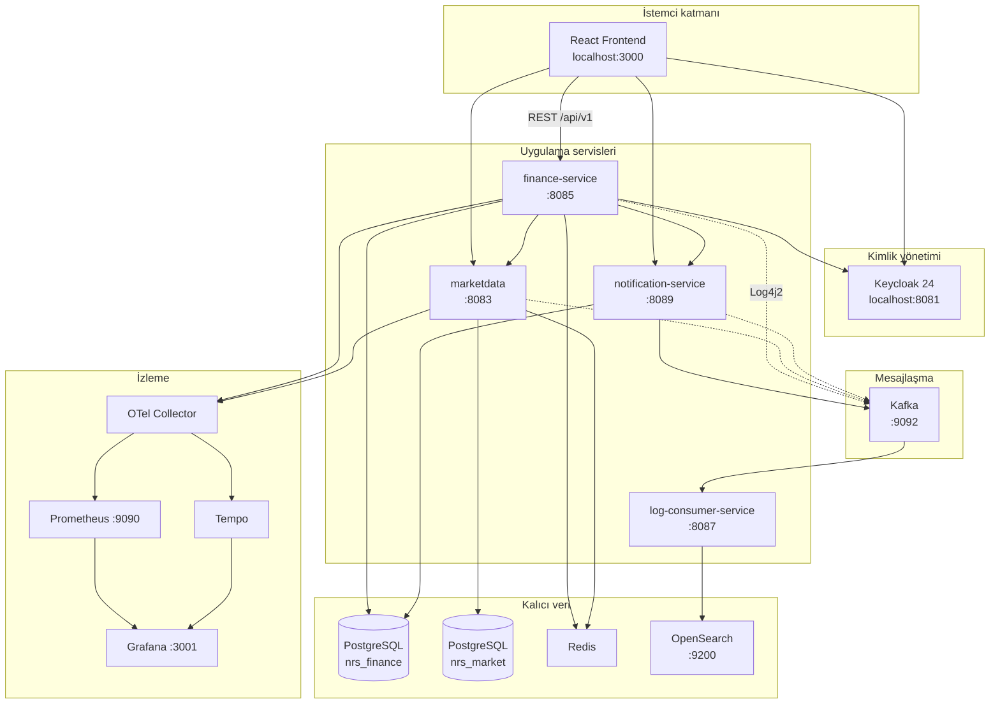

# NRS Finans Portalı

[](https://openjdk.org/)
[](https://spring.io/projects/spring-boot)
[](https://react.dev/)
[](docker-compose.yml)

**NRS Finans Portalı**, portföy yönetimi, canlı piyasa terminali, yatırım simülasyonu, VİOP/tahvil analizi, fiyat alarmları, Portföy AI ve admin gözlemlenebilirlik özelliklerini tek platformda birleştiren **çok modüllü** bir finans uygulamasıdır.

> **Kapsam:** Bu repository **Finans Portalı** projesidir. **IT Servis — Ticket Yönetimi** ve **jBPM** (proje isteri Madde 16) bu repoda yer almaz; ayrı bir projede değerlendirilir.

---

## İçindekiler

1. [Bu README kimler için?](#bu-readme-kimler-için)
2. [Proje özeti ve iş mantığı](#proje-özeti-ve-iş-mantığı)
3. [Teknoloji yığını](#teknoloji-yığını)
4. [Sistem mimarisi](#sistem-mimarisi)
5. [Kurulum — sıfırdan çalıştırma](#kurulum--sıfırdan-çalıştırma)
6. [Ortam değişkenleri (.env)](#ortam-değişkenleri-env)
7. [Servisler, portlar ve URL'ler](#servisler-portlar-ve-urller)
8. [Proje dizin yapısı](#proje-dizin-yapısı)
9. [Test etme](#test-etme)
10. [Dokümantasyon haritası](#dokümantasyon-haritası)
11. [Proje isterleri uyum tablosu](#proje-isterleri-uyum-tablosu)
12. [Sorun giderme (SSS)](#sorun-giderme-sss)
13. [Görseller ve demo GIF'leri](#görseller-ve-demo-gifleri)

---

## Bu README kimler için?

Bu dosya, projeyi **hiç bilmeyen** bir değerlendiricinin veya geliştiricinin:

- Repoyu klonlayıp **Docker ile tüm sistemi ayağa kaldırmasını**,
- Frontend ve API'lere erişmesini,
- Swagger, Grafana, OpenSearch gibi altyapıları doğrulamasını,
- Unit/integration testleri çalıştırmasını

sağlamak için yazılmıştır. Daha derin konular [`docs/`](docs/README.md) altındaki rehberlerde açıklanır.

---

## Proje özeti ve iş mantığı

### Kullanıcı perspektifi

| Modül | Ne yapar? |
|-------|-----------|
| **Dashboard** | Portföy özeti, KPI'lar, hızlı erişim |
| **Piyasa terminali** | FX, kripto, hisse, fon, VIOP, tahvil — canlı ve tarihsel veri |
| **Portföy** | Manuel pozisyonlar, reel getiri, konsantrasyon analizi |
| **Simülasyon** | Geçmiş bir tarihte yatırım yapsaydım bugün ne olurdu? |
| **VİOP / Tahvil analizi** | Pozisyon ekleme, kapanış, K/Z hesapları |
| **Portföy AI** | OpenAI destekli portföy analiz raporu (opsiyonel API key) |
| **Bildirimler** | Fiyat alarmları, sistem bildirimleri |
| **Admin** | Kullanıcı yönetimi, audit log, Grafana embed |

### Teknik perspektif

Uygulama **4 Spring Boot mikroservisi** + **1 React SPA** + **Docker Compose altyapısı** üzerinde çalışır:

```
Tarayıcı (React)
    │  JWT Bearer (Keycloak)
    ▼
finance-service ──► marketdata
    │                    │
    ▼                    ▼
PostgreSQL            PostgreSQL
(nrs_finance)         (nrs_market)
    │
    ├──► notification-service (Kafka events → e-posta / in-app)
    ├──► Redis (cache, rate limit)
    └──► Log4j2 ──► Kafka ──► log-consumer ──► OpenSearch
```

**Kimlik doğrulama:** Keycloak realm `nrs-finance`. Frontend `keycloak-js` ile oturum açar; backend OAuth2 Resource Server JWT doğrular.

**2FA:** TOTP desteği vardır. Kullanıcı **Ayarlar** ekranından etkinleştirir; girişte zorunlu değildir.

---

## Teknoloji yığını

| Katman | Teknoloji |
|--------|-----------|
| Frontend | React 19, TypeScript, Vite 7, TanStack Query, React Router, Keycloak JS |
| Backend | Java 21, Spring Boot 3.5.5, Spring Data JPA, Spring Security OAuth2 |
| Veritabanı | PostgreSQL 16, Liquibase migration |
| Cache | Redis 7 |
| Mesajlaşma | Apache Kafka (log + bildirim event'leri) |
| Kimlik | Keycloak 24, JWT |
| Loglama | Log4j2 → Kafka → OpenSearch |
| Gözlemlenebilirlik | OpenTelemetry, Prometheus, Grafana, Tempo |
| API dokümantasyonu | SpringDoc OpenAPI 3, Swagger UI |
| Konteyner | Docker, Docker Compose |
| CI | GitHub Actions |

---

## Sistem mimarisi

Detaylı açıklama: [`docs/architecture.md`](docs/architecture.md)



---

## Kurulum — sıfırdan çalıştırma

### Ön koşullar

| Yazılım | Minimum sürüm | Kontrol komutu |
|---------|---------------|----------------|
| Git | 2.x | `git --version` |
| Docker Desktop | 4.x (Compose v2) | `docker compose version` |
| (Opsiyonel) Java 21 | JDK 21 | `java -version` |
| (Opsiyonel) Node.js | 20+ | `node -version` |

> **Not:** Tam stack için yalnızca **Docker** yeterlidir. Java/Node yalnızca kaynak kodundan ayrı geliştirme/test için gereklidir.

### Adım 1 — Repoyu klonlayın

```powershell
git clone https://github.com/nurs3li/NrsFinancePortal.git
cd NrsFinancePortal
```

### Adım 2 — Ortam dosyasını oluşturun

```powershell
copy .env.example .env
```

`.env` dosyasını bir metin editöründe açın. **En az** `POSTGRES_PASSWORD` değerini değiştirin.

Piyasa/enflasyon verisi için (önerilir):

```env
EVDS_API_KEY=your-tcmb-evds-api-key
```

Anahtar alma: [TCMB EVDS](https://evds3.tcmb.gov.tr/)

### Adım 3 — Tüm servisleri başlatın

```powershell
docker compose up -d --build
```

İlk build **5–15 dakika** sürebilir (Maven derlemesi, Liquibase migration, Keycloak realm import).

### Adım 4 — Servis durumunu doğrulayın

```powershell
docker compose ps
```

Beklenen: `finance-service`, `market-data-service`, `notification-service`, `log-consumer-service`, `postgres`, `keycloak`, `kafka`, `redis`, `opensearch` servisleri **running** veya **healthy**.

Log takibi:

```powershell
docker compose logs -f finance-service
```

### Adım 5 — Uygulamayı açın

| Adım | URL | Beklenen |
|------|-----|----------|
| 1 | http://localhost:3000 | Finans Portalı landing / giriş |
| 2 | http://localhost:8085/actuator/health | `{"status":"UP"}` |
| 3 | http://localhost:8085/swagger-ui.html | Swagger UI |
| 4 | http://localhost:3001 | Grafana (admin / admin) |

Test kullanıcı bilgileri kurum tarafından ayrı e-posta ile iletilecektir. Self-servis kayıt ekranı da kullanılabilir.

### Adım 6 — Sistemi durdurma

```powershell
docker compose down
```

Veritabanı kalıcılığı için volume'ları da silmek (dikkat — veri gider):

```powershell
docker compose down -v
```

---

## Ortam değişkenleri (.env)

Tam referans: [`.env.example`](.env.example)

| Değişken | Zorunlu | Açıklama |
|----------|---------|----------|
| `POSTGRES_DB` | Evet | Varsayılan: `nrs_finance` |
| `POSTGRES_USER` | Evet | DB kullanıcı adı |
| `POSTGRES_PASSWORD` | Evet | DB şifresi |
| `EVDS_API_KEY` | Hayır* | Enflasyon, faiz, mevduat, eurobond (*piyasa makro verisi için gerekli) |
| `FINHUB_API_KEY` | Hayır | ABD hisse verisi |
| `OPENAI_API_KEY` | Hayır | Portföy AI özelliği |
| `GMAIL_*` | Hayır | E-posta bildirimleri |
| `VITE_*` | Hayır | Frontend API URL'leri (Docker varsayılanları genelde yeterli) |

Docker Compose, repo kökündeki `.env` dosyasını otomatik okur. Ekstra volume mapping gerekmez.

---

## Servisler, portlar ve URL'ler

### Docker Compose (değerlendirme ortamı)

| Bileşen | Host portu | Swagger / UI |
|---------|------------|--------------|
| **Frontend** | 3000 | http://localhost:3000 |
| **finance-service** | 8085 | http://localhost:8085/swagger-ui.html |
| **marketdata** | 8083 | http://localhost:8083/swagger-ui.html |
| **notification-service** | 8089 | http://localhost:8089/swagger-ui.html |
| **log-consumer-service** | 8087 | http://localhost:8087/swagger-ui.html |
| **Keycloak** | 8081 | http://localhost:8081 |
| **PostgreSQL** | 5432 | — |
| **Redis** | 6379 | — |
| **Kafka** | 9092 | — |
| **OpenSearch** | 9200 | — |
| **OpenSearch Dashboards** | 5601 | http://localhost:5601 |
| **Prometheus** | 9090 | http://localhost:9090 |
| **Grafana** | 3001 | http://localhost:3001 |
| **Tempo** | 3200 | — |

Modül bazlı detay: ilgili servis `README.md` dosyalarına bakın.

| Modül | README |
|-------|--------|
| finance-service | [finance-service/README.md](finance-service/README.md) |
| marketdata | [marketdata/README.md](marketdata/README.md) |
| notification-service | [notification-service/README.md](notification-service/README.md) |
| log-consumer-service | [log-consumer-service/README.md](log-consumer-service/README.md) |
| frontend | [frontend/README.md](frontend/README.md) |

### Yerel geliştirme portları (Docker olmadan)

| Servis | Varsayılan port |
|--------|-----------------|
| finance-service | 8080 |
| marketdata | 8086 |
| notification-service | 8089 |
| log-consumer-service | 8090 |
| frontend (Vite) | 5173 |

---

## Proje dizin yapısı

```
NrsFinancePortal/
├── README.md                    ← GitHub ana sayfa (bu dosya)
├── .env.example                 ← Ortam şablonu
├── docker-compose.yml           ← Tam stack tanımı
├── pom.xml                      ← Maven parent (Java 21)
│
├── frontend/                    ← React SPA
├── finance-service/             ← Ana portal API
├── marketdata/                  ← Piyasa verisi API
├── notification-service/        ← Bildirim & e-posta
├── log-consumer-service/        ← Log indeksleme
│
├── infra/                       ← Keycloak, Grafana, Prometheus, OTel, Postgres init
├── docs/                        ← Teknik dokümantasyon hub'ı
├── scripts/                     ← Javadoc üretimi vb.
├── tools/                       ← API katalog otomasyonu
└── .github/workflows/ci.yml     ← CI pipeline
```

Katmanlı mimari (her backend modülünde):

```
src/main/java/.../
├── api/              # REST controller, DTO, GlobalExceptionHandler
├── application/      # İş mantığı, use case servisleri
├── domain/           # Entity, domain modelleri
├── infrastructure/   # JPA, Kafka, Keycloak, dış API client'ları
└── config/           # Spring configuration
```

---

## Test etme

### CI (otomatik)

Her push/PR'da GitHub Actions çalışır: [`.github/workflows/ci.yml`](.github/workflows/ci.yml)

- 4 backend modülü: unit + integration (Testcontainers)
- Frontend: ESLint, Vitest, production build
- API contract gate
- Docker smoke build

### Yerel — backend

**Docker Desktop açık olmalı** (Testcontainers PostgreSQL/Redis/Kafka kullanır).

```powershell
cd finance-service
..\mvnw test

cd ..\marketdata
..\mvnw test

cd ..\notification-service
..\mvnw test

cd ..\log-consumer-service
..\mvnw test
```

Tüm modüller tek seferde (repo kökünden):

```powershell
.\mvnw test
```

### Yerel — frontend

```powershell
cd frontend
npm ci
npm test
npm run lint
npm run build
```

### Javadoc (Madde 20)

```powershell
.\scripts\Generate-Javadoc.ps1
```

Detay: [`docs/javadoc.md`](docs/javadoc.md)

---

## Dokümantasyon haritası

| Konu | Dosya |
|------|-------|
| **Dokümantasyon hub** | [docs/README.md](docs/README.md) |
| **Mimari derinlemesine** | [docs/architecture.md](docs/architecture.md) |
| **Adım adım kurulum + doğrulama** | [docs/getting-started.md](docs/getting-started.md) |
| **REST API & OpenAPI** | [docs/api/README.md](docs/api/README.md) |
| **Javadoc** | [docs/javadoc.md](docs/javadoc.md) |
| **Observability (Grafana, OTel, OpenSearch)** | [docs/observability/README.md](docs/observability/README.md) |
| **Güvenlik (Keycloak, JWT, 2FA)** | [docs/security/README.md](docs/security/README.md) |
| **README görselleri / GIF rehberi** | [docs/assets/README.md](docs/assets/README.md) |

---

## Proje isterleri uyum tablosu

| # | İster | Durum | Kanıt |
|---|--------|--------|-------|
| 1 | ReactJS | ✅ | `frontend/` |
| 2 | Java 21 | ✅ | `pom.xml` |
| 3 | Spring Boot 3.x | ✅ | 3.5.5 |
| 4 | Log4j2 | ✅ | `log4j2-spring.xml` |
| 5 | PostgreSQL | ✅ | `docker-compose.yml` |
| 6 | JPA / Hibernate | ✅ | Spring Data JPA |
| 7 | Liquibase | ✅ | `db/changelog/` |
| 8 | JWT + Keycloak | ✅ | `infra/keycloak/` |
| 9 | 2FA (opsiyonel TOTP) | ✅ | Ayarlar + Keycloak |
| 10 | OpenTelemetry | ✅ | OTel collector |
| 11 | Grafana + Prometheus | ✅ | `infra/grafana/` |
| 12 | OpenSearch | ✅ | compose stack |
| 13 | Log pipeline | ✅ | Kafka + log-consumer |
| 14 | Docker | ✅ | compose + Dockerfile'lar |
| 15 | Git + commit | ✅ | aktif commit geçmişi |
| 16 | jBPM | ❌ | Ayrı proje (IT Ticket) |
| 17 | Redis cache | ✅ | rate limit, market cache |
| 18 | `/api/v1/` | ✅ | `ApiPaths.java` |
| 19 | OpenAPI / Swagger | ✅ | SpringDoc |
| 20 | Javadoc | ✅ | `Generate-Javadoc.ps1` |
| 21 | README | ✅ | bu dosya + modül README'leri |
| 22 | Unit test | ✅ | ~160 backend + 9 frontend |
| 23 | Error handling | ✅ | `GlobalExceptionHandler` |
| 24 | Katmanlı mimari | ✅ | api/application/domain/infra |

**Finans Portalı (Madde 16 hariç): ~%95+**

---

## Sorun giderme (SSS)

<details>
<summary><strong>Port 3000 veya 8085 already in use</strong></summary>

```powershell
docker compose down
netstat -ano | findstr :3000
netstat -ano | findstr :8085
```

Çakışan süreci kapatın veya `docker-compose.yml` port mapping'ini değiştirin.

</details>

<details>
<summary><strong>finance-service sürekli restarting</strong></summary>

Market-data servisinin healthy olmasını bekler:

```powershell
docker compose logs market-data-service
docker compose logs finance-service
```

</details>

<details>
<summary><strong>Piyasa / enflasyon verisi boş</strong></summary>

`.env` içinde `EVDS_API_KEY` tanımlı mı kontrol edin. Key almadan makro paneller boş kalabilir.

</details>

<details>
<summary><strong>Keycloak redirect_uri mismatch</strong></summary>

Frontend'i `http://localhost:3000` üzerinden kullanın (`frontend-dev` servisi). Vite `:5173` ile Keycloak redirect URI uyuşmayabilir.

</details>

<details>
<summary><strong>Swagger 401 Unauthorized</strong></summary>

Swagger UI'da sağ üst **Authorize** → JWT Bearer token yapıştırın (Keycloak login sonrası).

</details>

---

## Görseller ve demo GIF'leri

README'ye animasyonlu klasör turu veya kurulum demosu eklemek için:

1. [ScreenToGif](https://www.screentogif.com/) ile kayıt alın.
2. `docs/assets/` klasörüne kaydedin.
3. Aşağıdaki satırın yorumunu kaldırın veya benzeri ekleyin:

```markdown

```

Ayrıntılı rehber: **[docs/assets/README.md](docs/assets/README.md)**

---

**Geliştirici:** NRS Finans Portalı ekibi · Eğitim / proje teslimi kapsamı
