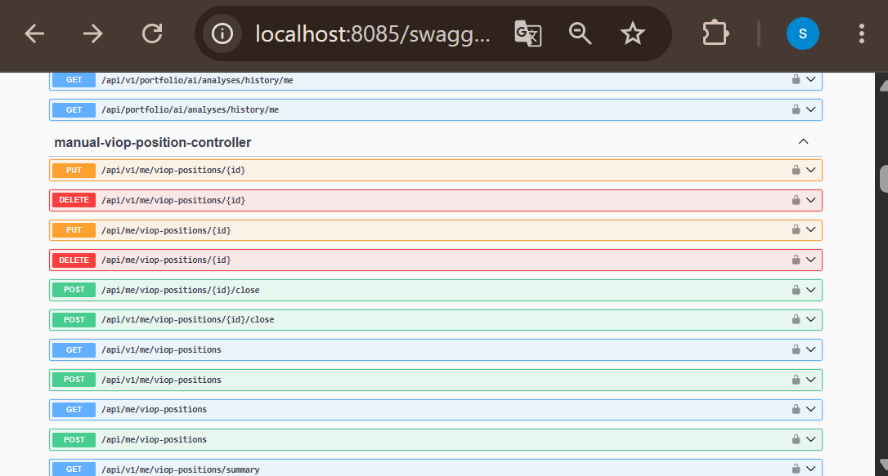

<p align="center">
  
</p>

<p align="center"><strong>Languages / Diller:</strong> <a href="endpoints.md">English</a> · <a href="endpoints.tr.md">Türkçe</a></p>

---

# API endpoint quick reference

**Source of truth:** SpringDoc `/v3/api-docs` and controller source. This file is a **quick reference** for reviewers and integration tests.

Swagger UI: [`docs/api/README.md`](./README.md)

---

## finance-service — public (no JWT)

Base: `http://localhost:8085` · Prefix: `/api/v1/public/...` and legacy `/api/public/...`

### Registration — `PublicRegistrationController`

| Method | Path | Body (JSON) | Response `data` |
|--------|------|-------------|-----------------|
| POST | `/api/public/register/request-code` | `{ "email": "user@example.com" }` | Success message string |
| POST | `/api/public/register/complete` | `{ "email", "username", "firstName", "lastName", "password", "code" }` | Success message string |

Requires Gmail OAuth for email delivery — [`docs/email-setup.md`](../email-setup.md).

### Login — `PublicLoginController`

| Method | Path | Body | Notes |
|--------|------|------|-------|
| POST | `/api/public/login` | `{ "usernameOrEmail", "password", "otp", "rememberMe" }` | Returns tokens or `otpRequired: true` |
| POST | `/api/public/token/refresh` | `{ "refreshToken" }` | New access/refresh pair |

### Password reset — `PublicPasswordResetController`

| Method | Path | Body | Step |
|--------|------|------|------|
| POST | `/api/public/password-reset/request-code` | `{ "email" }` | 1 — send code |
| POST | `/api/public/password-reset/verify-code` | `{ "email", "code" }` | 2 — verify code |
| POST | `/api/public/password-reset/complete` | `{ "email", "newPassword", "confirmPassword" }` | 3 — set Keycloak password |

Landing UI: Sign in tab → **Forgot password** (not a separate route).

---

## finance-service — authenticated user

Base path: `/api/v1/users/me/...` (legacy `/api/users/me/...`) · JWT required

| Method | Path | Controller | Purpose |
|--------|------|------------|---------|
| PATCH | `/api/users/me/username` | `UserProfileController` | Change username |
| PATCH | `/api/users/me/profile` | `UserProfileController` | Update first/last name |
| POST | `/api/users/me/email/request-code` | `UserProfileController` | Email change verification code |
| POST | `/api/users/me/email/confirm` | `UserProfileController` | Confirm new email |
| POST | `/api/users/me/password` | `UserProfileController` | Change password (current password required) |
| GET | `/api/users/me/totp` | `UserTotpController` | TOTP status |
| POST | `/api/users/me/totp/setup` | `UserTotpController` | Start TOTP setup |
| POST | `/api/users/me/totp/confirm` | `UserTotpController` | Confirm TOTP |
| POST | `/api/users/me/totp/cancel` | `UserTotpController` | Disable TOTP |

---

## finance-service — admin

Base: `/api/v1/admin/...` · Role **ADMIN** required

| Method | Path | Controller | Purpose |
|--------|------|------------|---------|
| POST | `/api/admin/users/{userId}/suspend-login` | `AdminUserSuspensionController` | Suspend portal login (optional `{ "reason" }`) |
| POST | `/api/admin/users/{userId}/unsuspend-login` | `AdminUserSuspensionController` | Remove suspension |
| DELETE | `/api/admin/users/{userId}` | `AdminUserSuspensionController` | Delete user (Keycloak + DB) |

Suspension sets Keycloak `enabled=false` and blocks API via `FrozenUserAccessFilter`. **ADMIN users and self-suspension are rejected.**

---

## marketdata — access model

Base: `http://localhost:8083`

### Public GET (no JWT)

Configured in `marketdata/.../SecurityConfig.java`:

| Pattern | Examples |
|---------|----------|
| `/api/market/**`, `/api/v1/market/**` | Bank rates, macro, crypto, FX, history, equity |
| `/api/news/**` | Financial news |
| `/api/funds/**`, `/api/fund/**` | TEFAS funds |
| `/api/viop/**` | VIOP |
| `/api/debt/**` | Debt instruments |

Swagger and actuator paths are also public.

### Authenticated admin

| Pattern | Role |
|---------|------|
| POST `/api/admin/**` | ADMIN or OPS |
| `/internal/**` | ADMIN or OPS (except token-gated backfill below) |

### Internal backfill (`ops` profile)

Controller: `BackfillController` · Base: `/internal/market/backfill`

When `app.internal.backfill-token` / env `NRS_INTERNAL_BACKFILL_TOKEN` is set, these require header:

```http
X-Nrs-Internal-Token: <same value as NRS_INTERNAL_BACKFILL_TOKEN>
```

| Method | Path | Notes |
|--------|------|-------|
| POST | `/internal/market/backfill/bist-daily` | BIST daily backfill |
| POST | `/internal/market/backfill/crypto-history` | Crypto warmup |
| POST | `/internal/market/backfill/debt-history` | Debt history |
| POST | `/internal/market/backfill/etf-history` | ETF history |
| POST | `/internal/market/backfill/isyatirim-metals-usd` | Metals USD |
| POST | `/internal/market/backfill/tcmb` | TCMB FX (query `days`) |
| POST | `/internal/market/backfill/viop-csv` | VIOP CSV import |

Docker default token: see `docker-compose.yml` → `NRS_INTERNAL_BACKFILL_TOKEN`.

---

## notification-service

Base: `http://localhost:8089`

### User inbox (JWT)

| Method | Path | Purpose |
|--------|------|---------|
| GET | `/api/v1/notifications/me` | Paginated notifications (`?unreadOnly=true`) |
| GET | `/api/v1/notifications/me/unread-count` | Unread count |
| PATCH | `/api/v1/notifications/{id}/read` | Mark read |

### Internal (S2S JWT)

| Method | Path | Purpose |
|--------|------|---------|
| POST | `/api/notifications/internal/email/send` | Direct email `{ "to", "subject", "body" }` → 202 Accepted |

Called by `finance-service` `RegistrationEmailSender` (not Keycloak SMTP).

### Kafka

| Topic | Consumer | Purpose |
|-------|----------|---------|
| `notification-events` | `NotificationEventConsumer` | In-app notifications (+ optional email body in event) |

---

## log-consumer-service

| Topic | Index pattern |
|-------|---------------|
| `application-logs` | `application-logs-yyyy-MM-dd` in OpenSearch |

See [`docs/observability/README.md`](../observability/README.md).

---

## Swagger UI

Example (finance-service): http://localhost:8085/swagger-ui.html · All services: [`docs/api/README.md`](./README.md)

<p align="center">
  
</p>

---

[← API overview](./README.md) · [Email setup →](../email-setup.md) · [Security →](../security/README.md)
