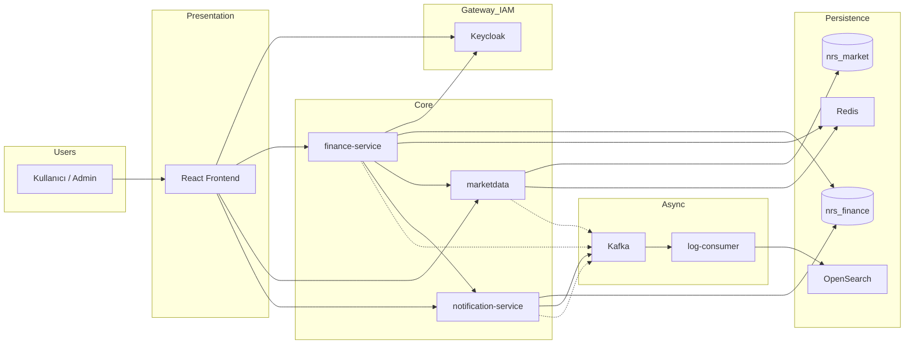

# Sistem mimarisi

NRS Finans Portalı **event-driven**, **gözlemlenebilir** ve **kimlik merkezli** bir mikroservis mimarisi kullanır.

---

## 1. Mimari prensipler

| Prensip | Uygulama |
|---------|----------|
| **Katmanlı mimari** | `api` → `application` → `domain` → `infrastructure` |
| **Ayrık veritabanları** | `nrs_finance` (portal) ve `nrs_market` (piyasa) |
| **Merkezi kimlik** | Keycloak — tüm servisler JWT resource server |
| **Async loglama** | Log4j2 → Kafka → OpenSearch (request path'i bloklamaz) |
| **Cache** | Redis — rate limit, market snapshot, notification dedup |
| **API versiyonlama** | `/api/v1/...` (+ geriye dönük legacy path) |

---

## 2. Bileşen diyagramı



---

## 3. Servis sorumlulukları

### finance-service

- Kullanıcı profili, kayıt (public API), admin kullanıcı yönetimi
- Manuel portföy, VIOP/tahvil pozisyonları
- Simülasyon, price alert, Portföy AI
- Market terminal proxy (marketdata'ya delegasyon)
- Admin audit log sorguları (OpenSearch)
- Keycloak admin entegrasyonu (rol, OTP policy)

### marketdata

- Dış kaynaklardan veri ingest: TCMB EVDS, BIST, VIOP CSV, TEFAS, banka kurları, FinHub, CoinGecko vb.
- REST API: fiyat, tarihsel veri, enflasyon, faiz, eurobond
- Zamanlanmış görevler (scheduler) ve startup backfill
- Liquibase: `nrs_market` şeması

### notification-service

- Kafka event tüketimi → in-app bildirim
- Gmail OAuth ile e-posta gönderimi
- S2S JWT (finance-service → notification internal API)

### log-consumer-service

- Kafka topic `application-logs` dinler
- Günlük index: `application-logs-yyyy-MM-dd` → OpenSearch
- Transaction/event mesajları (varsa) ayrı consumer'lar

### frontend

- SPA — React Router, TanStack Query
- Keycloak JS adapter — token refresh, role guard
- Grafana panel embed (admin audit)

---

## 4. İstek akışı örneği — portföy listesi

```
1. Kullanıcı /portfolio sayfasını açar
2. React: financeClient.get('/api/v1/portfolio/...')
3. Axios interceptor: Authorization: Bearer <JWT>
4. finance-service SecurityFilterChain: JWT doğrula (Keycloak issuer)
5. PortfolioController → PortfolioService → Repository
6. PostgreSQL nrs_finance sorgusu
7. ApiResponse envelope JSON döner
8. React state güncellenir, UI render
```

Paralel: Log4j2 JSON satırı → Kafka (WARN+) → log-consumer → OpenSearch.

Trace: Micrometer OTel bridge → OTel Collector → Tempo → Grafana.

---

## 5. Güvenlik mimarisi

```
┌─────────────┐     password / OTP      ┌──────────────┐
│   Frontend  │ ───────────────────────►│  Keycloak    │
│             │◄──── access_token ──────│  realm:      │
└──────┬──────┘                         │  nrs-finance │
       │ JWT Bearer                     └──────────────┘
       ▼
┌─────────────┐
│ finance /   │
│ market /    │  @PreAuthorize, role claims, rate limit
│ notification│
└─────────────┘
```

**2FA:** Kullanıcı TOTP secret'ını etkinleştirir → login'de OTP istenir. Zorunlu değildir.

Detay: [security/README.md](./security/README.md)

---

## 6. Veri ve migration

| Veritabanı | Migration aracı | Changelog konumu |
|------------|-------------------|------------------|
| nrs_finance | Liquibase | `finance-service/.../db/changelog/` |
| nrs_market | Liquibase | `marketdata/.../db/changelog/` |
| notification şeması | Liquibase | `notification-service/.../db/changelog/` |

`spring.jpa.hibernate.ddl-auto: none` — şema yalnızca Liquibase ile yönetilir.

---

## 7. Gözlemlenebilirlik

| Sinyal | Araç | Erişim |
|--------|------|--------|
| Metrik | Prometheus + Actuator | :9090, `/actuator/prometheus` |
| Dashboard | Grafana | :3001 |
| Trace | OTel → Tempo | Grafana Tempo datasource |
| Log | OpenSearch | :9200, Dashboards :5601 |
| Korelasyon | `traceId`, `spanId`, `correlationId` in JSON logs | OpenSearch filter |

Detay: [observability/README.md](./observability/README.md)

---

## 8. Docker Compose topolojisi

Tüm bileşenler `docker-compose.yml` ile tanımlıdır. Bağımlılık sırası (basitleştirilmiş):

```
postgres, redis, kafka, keycloak, opensearch
    → market-data-service (health)
        → finance-service
    → notification-service
    → log-consumer-service
    → frontend-dev
    → otel-collector, prometheus, grafana, tempo
```

---

[← Dokümantasyon hub](./README.md) · [Kurulum →](./getting-started.md)
