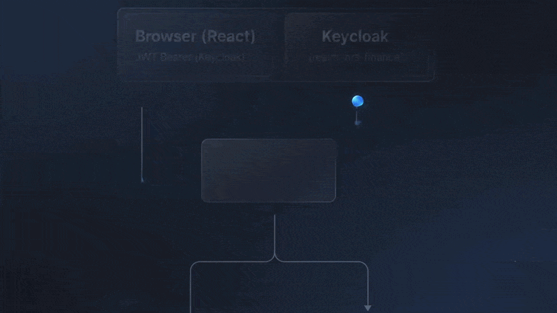
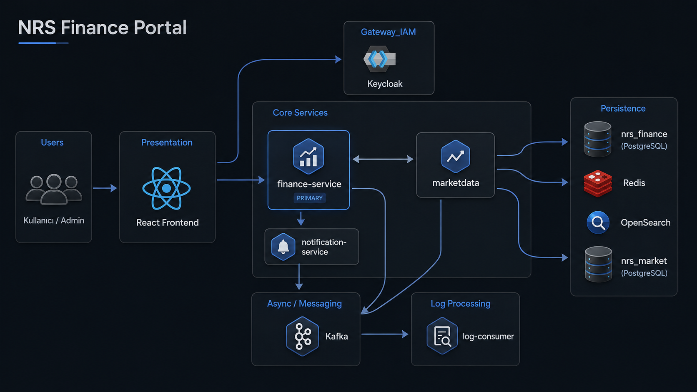
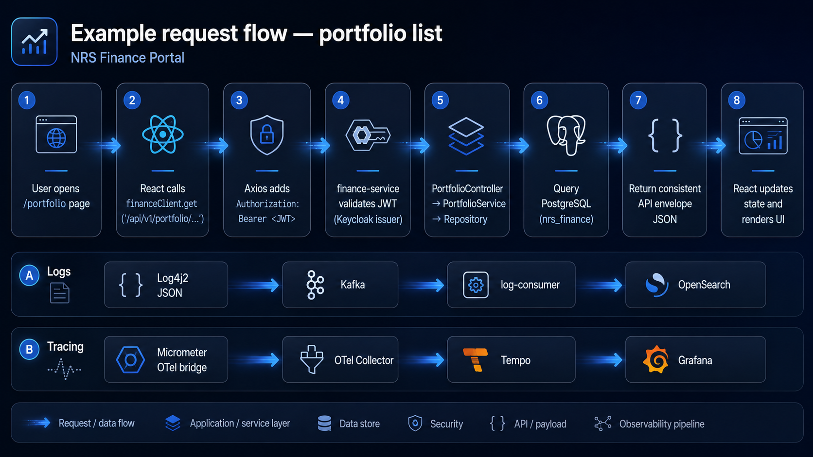
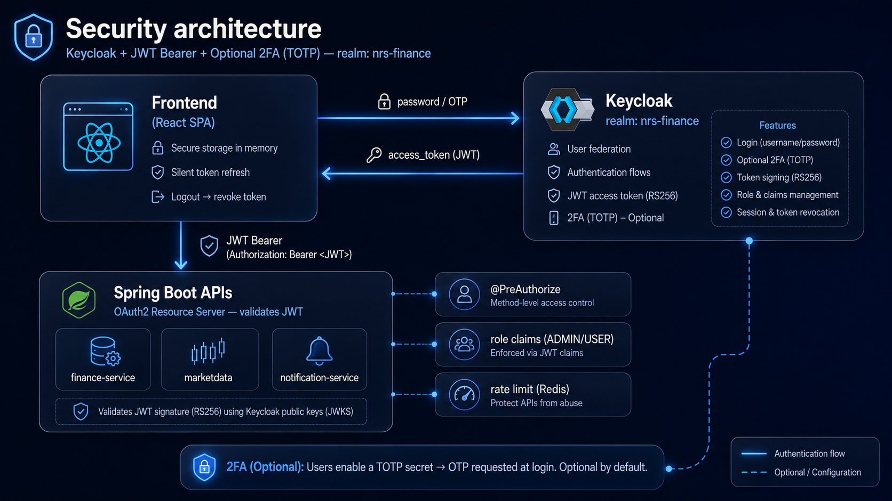
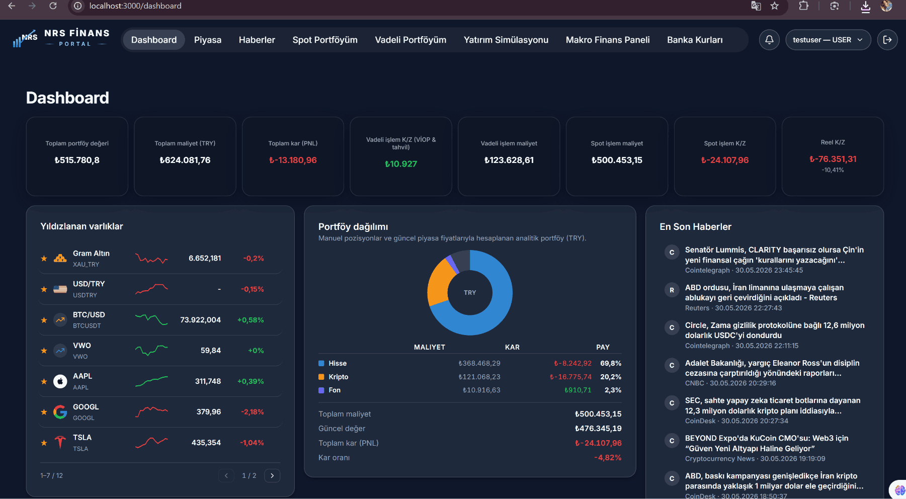
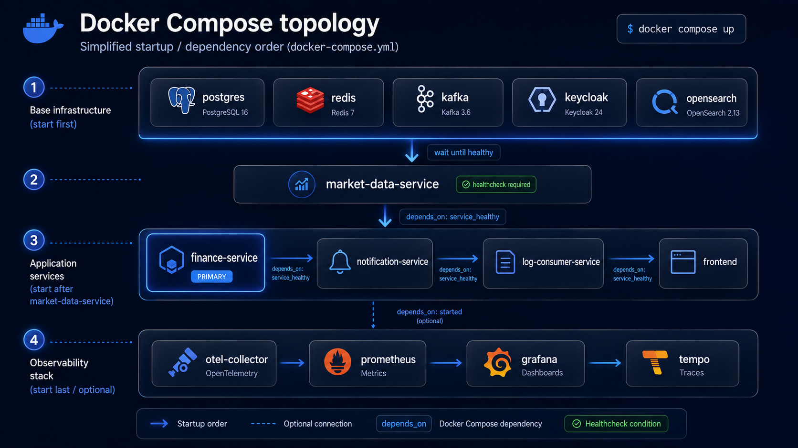

  

<strong>Languages / Diller:</strong> <a href="architecture.md">English</a> · <a href="architecture.tr.md">Türkçe</a>

---

# Sistem mimarisi

NRS Finance Portal; **olay güdümlü**, **gözlemlenebilir** ve **kimlik merkezli** bir mikroservis mimarisi kullanır.

  

---

## 1. Mimari prensipler

| Prensip | Uygulama |
|---------|----------|
| **Katmanlı mimari** | `api` → `application` → `domain` → `infrastructure` |
| **Ayrık veritabanları** | `nrs_finance` (portal) ve `nrs_market` (piyasa verisi) |
| **Merkezi kimlik** | Keycloak — servisler JWT OAuth2 Resource Server olarak çalışır |
| **Asenkron loglama** | Log4j2 → Kafka → OpenSearch (istek yolunu bloklamaz) |
| **Önbellekleme** | Redis — rate limit, piyasa snapshot, bildirim dedup |
| **API versiyonlama** | `/api/v1/...` (+ gerektiğinde geriye dönük legacy path'ler) |

---

## 2. Bileşen diyagramı

---

## 3. Servis sorumlulukları

### finance-service

- Kullanıcı profili, kayıt (public API), admin kullanıcı yönetimi
- Manuel portföy, VIOP/tahvil pozisyonları
- Simülasyon, fiyat alarmları, Portföy AI
- Piyasa terminali proxy (`marketdata`'ya delegasyon)
- Admin audit log sorguları (OpenSearch)
- Keycloak admin entegrasyonları (roller, OTP policy)

### marketdata

- Dış kaynaklardan veri ingest: TCMB EVDS, BIST, VIOP CSV, TEFAS, banka FX kurları, FinHub, CoinGecko vb.
- REST API: fiyat, tarihsel veri, enflasyon, faiz, eurobond
- Zamanlanmış görevler (scheduler) ve startup backfill
- Liquibase ile yönetilen `nrs_market` şeması

### notification-service

- Kafka event tüketimi → uygulama içi bildirimler
- Gmail OAuth ile e-posta gönderimi
- Servisler arası JWT (finance-service → notification internal API)

### log-consumer-service

- Kafka topic `application-logs` tüketimi
- Günlük indeksler: `application-logs-yyyy-MM-dd` → OpenSearch
- İşlem/event akışları için ek consumer'lar (etkinse)

### frontend

- SPA — React Router, TanStack Query
- Keycloak JS adapter — token yenileme, rol korumaları
- Grafana panel embed'leri (admin audit)

---

## 4. Örnek istek akışı — portföy listesi

---

## 5. Güvenlik mimarisi

Detay: [security/README.tr.md](./security/README.tr.md)

---

## 6. Veri ve migration

| Veritabanı | Migration aracı | Changelog konumu |
|------------|-------------------|------------------|
| nrs_finance | Liquibase | `finance-service/.../db/changelog/` |
| nrs_market | Liquibase | `marketdata/.../db/changelog/` |
| notification şeması | Liquibase | `notification-service/.../db/changelog/` |

`spring.jpa.hibernate.ddl-auto: none` — şemalar yalnızca Liquibase ile yönetilir.

---

## Manuel portföy — materialized read yolu

`finance-service`, manuel portföy dashboard'ları için **materialized read** katmanı kullanır (yüksek seviye):

| Konu | Bileşen |
|------|---------|
| Fiyat ağacı / warmup | `ManualPortfolioWarmupService`, `ManualPortfolioPriceTreeLoader` |
| Okuma API'leri | `ManualPortfolioReadService` (`PortfolioController`) |
| Değer snapshot'ları | `PortfolioValueSnapshot`, pozisyon değişiminde tetiklenir |
| Gap-fill | Yeni sembollerde eksik geçmiş incremental warmup ile doldurulur |

Frontend standart `/api/v1/portfolio/**` uç noktalarını çağırır.

  

---

## Frontend → üç backend tabanı

SPA üç API'ye bağlanır (`VITE_*`):

| Backend | Varsayılan URL | Örnekler |
|---------|----------------|----------|
| finance-service | http://localhost:8085 | Portföy, auth, admin, simülasyon |
| marketdata | http://localhost:8083 | Piyasa terminali, makro, haber (çoğu public GET) |
| notification-service | http://localhost:8089 | Uygulama içi bildirimler |

Keycloak (:8081) oturum token'ı; Grafana gömüleri `VITE_GRAFANA_*`.

---

## Olaylar ve bildirimler (Kafka)

`finance-service`, **`notification-events`** topic'ine `NotificationEventKafkaPublisher` ile yazar (**transactional outbox yok**). `notification-service` tüketir; isteğe bağlı e-posta Gmail ile gider.

---

## 7. Gözlemlenebilirlik

| Sinyal | Araç | Erişim |
|--------|------|--------|
| Metrikler | Prometheus + Actuator | :9090, `/actuator/prometheus` |
| Dashboard'lar | Grafana | :3001 |
| Trace | OTel → Tempo | Grafana Tempo datasource |
| Loglar | OpenSearch | :9200, Dashboards :5601 |
| Korelasyon | JSON loglarda `traceId`, `spanId`, `correlationId` | OpenSearch filtreleri |

Detay: [observability/README.tr.md](./observability/README.tr.md)

---

## 8. Docker Compose topolojisi

  

---

[← Dokümantasyon merkezi](./README.tr.md) · [Başlarken →](./getting-started.tr.md)
