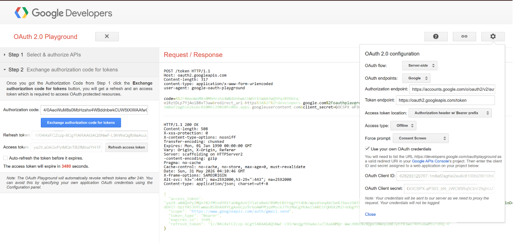
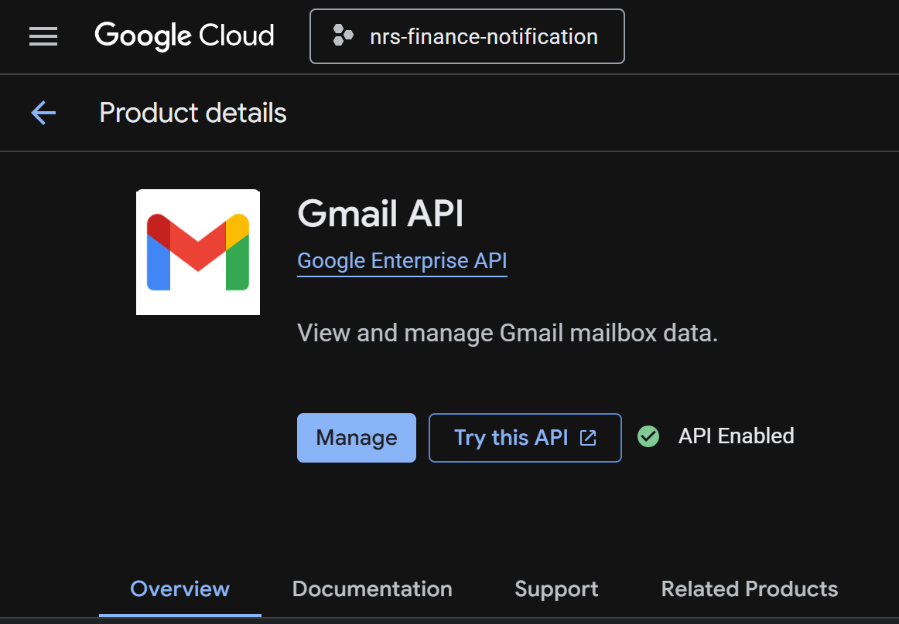

<p align="center">
  
</p>

<p align="center"><strong>Languages / Diller:</strong> <a href="email-setup.md">English</a> · <a href="email-setup.tr.md">Türkçe</a></p>

---

# E-posta kurulumu (Gmail OAuth)

NRS Finance Portal işlem e-postalarını **Gmail API + OAuth 2.0** ile gönderir. Kayıt kodu, şifre sıfırlama, profil e-posta değişikliği ve notification-service teslimatı için **Keycloak SMTP kullanılmaz**.

---

## Mimari

```
finance-service (PublicRegistration / PasswordReset / UserProfile)
    → POST notification-service /api/notifications/internal/email/send
        → Gmail API (OAuth refresh token)
            → Kullanıcı gelen kutusu
```

| Akış | Tetikleyici | finance-service | notification-service |
|------|-------------|-----------------|----------------------|
| Kayıt kodu | Landing → Kayıt | `POST /api/public/register/request-code` | Internal email send |
| Şifre sıfırlama kodu | Landing → Şifremi unuttum | `POST /api/public/password-reset/request-code` | Internal email send |
| E-posta değişikliği kodu | Ayarlar | `POST /api/users/me/email/request-code` | Internal email send |
| Portföy AI / alarmlar / admin | Çeşitli | Kafka `notification-events` veya internal email | Gmail gönderimi |

---

## Ön koşullar

- [Google Cloud Console](https://console.cloud.google.com/) erişimi
- `notification-service` ve `finance-service` ayakta (tam Docker yığını önerilir)
- `KEYCLOAK_ADMIN_*` yapılandırılmış (finance-service, notification internal API için bearer alır)

---

## Adım 1 — Google Cloud projesi

1. GCP projesi oluşturun veya seçin.
2. **Gmail API**'yi etkinleştirin: APIs & Services → Library → Gmail API → Enable.

---

## Adım 2 — OAuth consent screen

1. APIs & Services → OAuth consent screen.
2. **External** (veya Workspace için Internal).
3. Uygulama adı, destek e-postası, geliştirici iletişimi.
4. Scope: `https://www.googleapis.com/auth/gmail.send`
5. Uygulama **Testing** modundayken test kullanıcıları ekleyin.

---

## Adım 3 — OAuth client kimlik bilgileri

1. Credentials → **Create credentials** → **OAuth client ID**.
2. Tip: **Desktop app** (veya kontrol ettiğiniz redirect ile Web).
3. **Client ID** ve **Client secret** → `.env`:

```env
GMAIL_CLIENT_ID=your-client-id.apps.googleusercontent.com
GMAIL_CLIENT_SECRET=your-client-secret
```

---

## Adım 4 — Refresh token (OAuth Playground)

1. [Google OAuth 2.0 Playground](https://developers.google.com/oauthplayground/) açın.
2. Dişli → **Use your own OAuth credentials** → Client ID / Secret girin.
3. Adım 1: `https://www.googleapis.com/auth/gmail.send` → Authorize.
4. Adım 2: **Exchange authorization code for tokens** → **Refresh token** kopyalayın.

```env
GMAIL_REFRESH_TOKEN=your-refresh-token
GMAIL_FROM_ADDRESS=your-sender@gmail.com
NOTIFICATION_TEST_EMAIL=optional-test-recipient@gmail.com
FINANCE_BASE_URL=http://localhost:8085
```

5. Servisleri yeniden başlatın:

```powershell
docker compose up -d --build notification-service finance-service
```

---

## Ortam değişkenleri

[`.env.example`](../../.env.example) (`.env`'e kopyalayın):

| Değişken | Servis | Amaç |
|----------|--------|------|
| `GMAIL_CLIENT_ID` | notification-service | OAuth client ID |
| `GMAIL_CLIENT_SECRET` | notification-service | OAuth client secret |
| `GMAIL_REFRESH_TOKEN` | notification-service | Kalıcı gönderim token'ı |
| `GMAIL_FROM_ADDRESS` | notification-service | Gönderen adresi |
| `NOTIFICATION_TEST_EMAIL` | notification-service | İsteğe bağlı test alıcısı |
| `FINANCE_BASE_URL` | notification-service | S2S kullanıcı sorgusu |
| `KEYCLOAK_NOTIFICATION_S2S_SECRET` | notification-service | Backend client secret |

finance-service (internal email çağrıları):

| Değişken | Amaç |
|----------|------|
| `KEYCLOAK_ADMIN_ENABLED` | Admin client |
| `KEYCLOAK_ADMIN_CLIENT_ID` / `KEYCLOAK_ADMIN_CLIENT_SECRET` | notification internal API bearer |

---

## Test — kayıt (UI)

1. Gmail değişkenleri dolu, servisler healthy.
2. http://localhost:3000 → **Kayıt**.
3. E-posta → **Doğrulama kodu gönder** → gelen kutusu → kayıt tamamla.

<p align="center">
  
</p>

---

## Test — şifre sıfırlama (UI)

Şifremi unuttum **ayrı route değil** — landing giriş sekmesinde:

1. http://localhost:3000 → Giriş → **Şifremi unuttum**.
2. E-posta → kod → yeni şifre.
3. API: `request-code` → `verify-code` → `complete`.

<p align="center">
  
</p>

---

## Test — API (curl)

Kayıt:

```powershell
curl.exe -X POST http://localhost:8085/api/public/register/request-code `
  -H "Content-Type: application/json" `
  -d "{\"email\":\"you@example.com\"}"
```

Şifre sıfırlama:

```powershell
curl.exe -X POST http://localhost:8085/api/public/password-reset/request-code `
  -H "Content-Type: application/json" `
  -d "{\"email\":\"testuser@example.com\"}"
```

---

## Sorun giderme

| Belirti | Kontrol |
|---------|---------|
| Doğrulama maili gönderilemedi | `docker compose logs notification-service`, token süresi |
| Mail yok | `GMAIL_*` boş; demo `testuser` / `nrsadmin` kullanın |
| Internal email 401 | `KEYCLOAK_ADMIN_*` ve S2S secret uyumu |
| OAuth erişim engellendi | Consent screen **Test user** listesi |

---

## Ekran görüntüleri (Gmail OAuth kurulumu)

<p align="center">
  
</p>

<p align="center">
  
</p>

---

[← Dokümantasyon merkezi](./README.tr.md) · [API uç noktaları →](./api/endpoints.tr.md) · [Keycloak bootstrap →](./ops/keycloak-bootstrap.tr.md)
