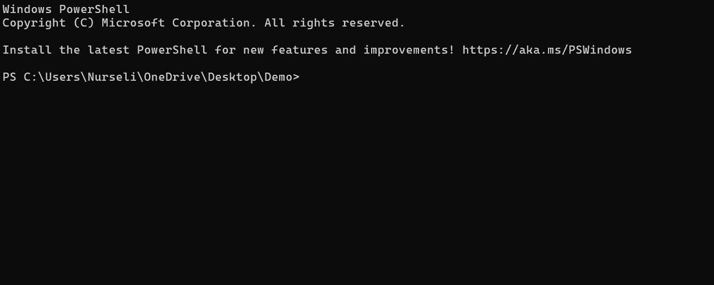
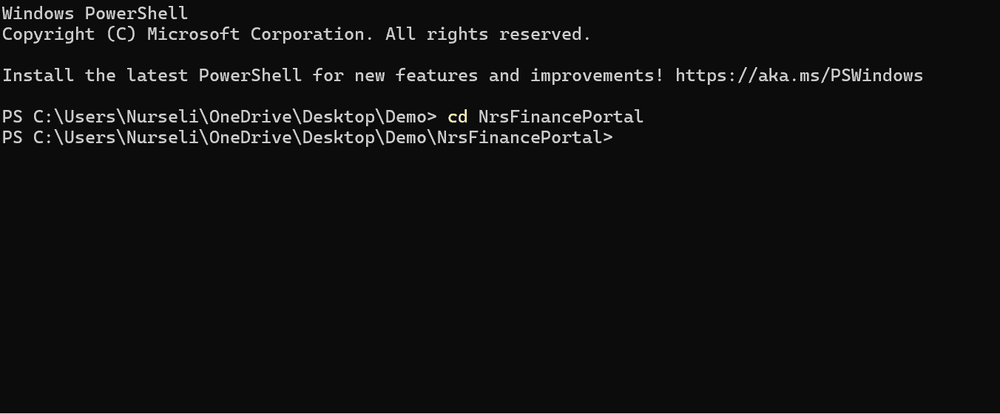
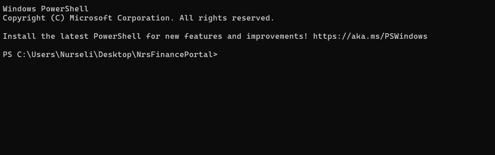
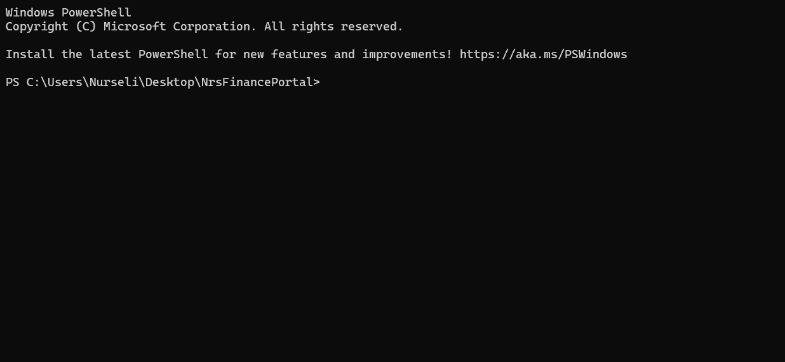
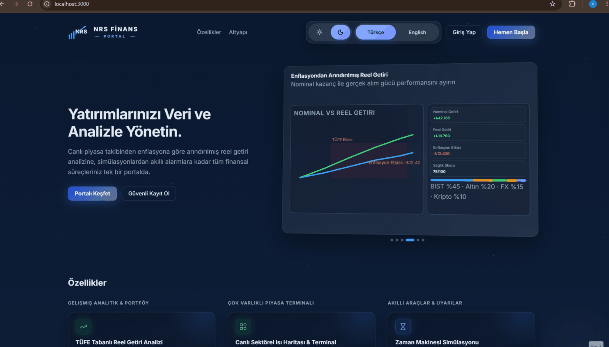
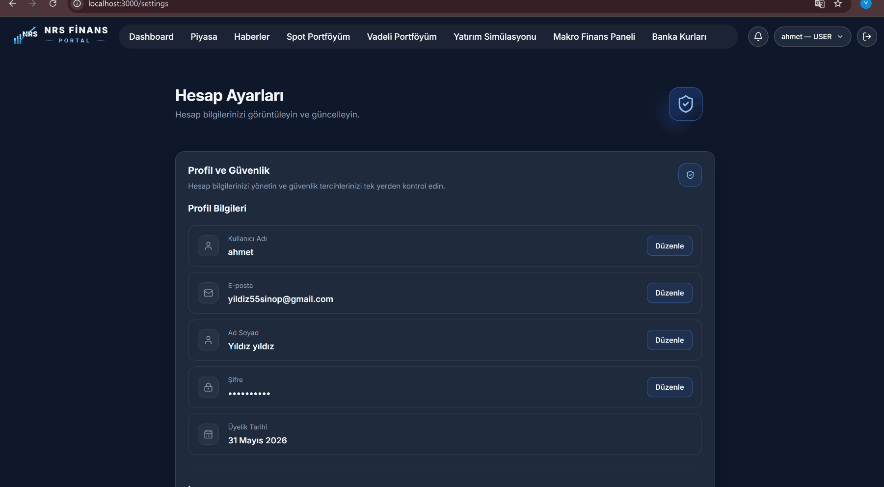
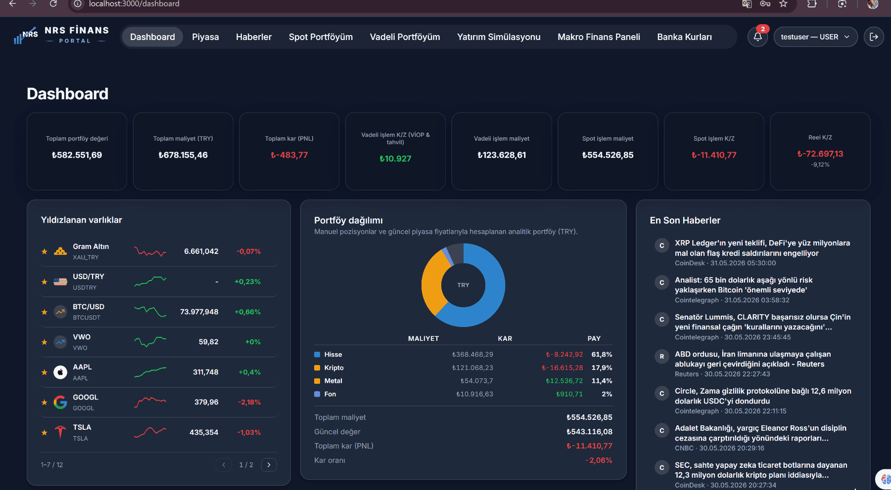
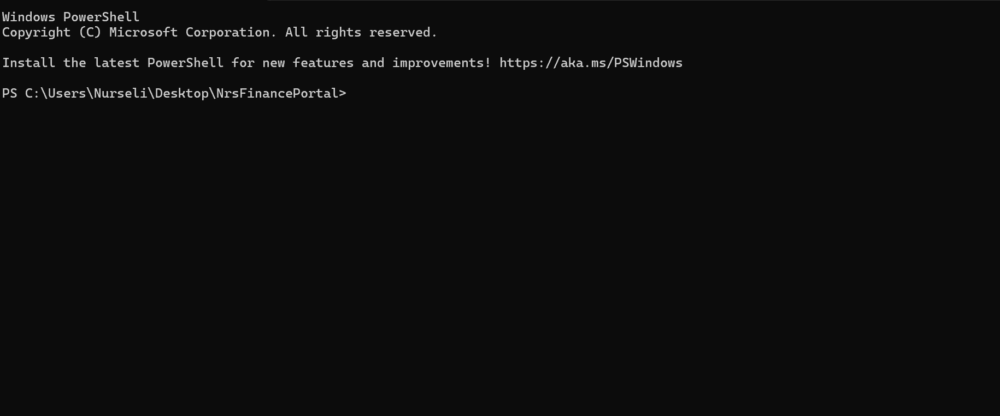

<p align="center">
  
</p>

<p align="center"><strong>Languages / Diller:</strong> <a href="getting-started.md">English</a> · <a href="getting-started.tr.md">Türkçe</a></p>

---

# Getting started (setup & verification)

This guide helps you bring the platform up **from scratch** and verify the stack **layer by layer**. For a high-level overview and quick path, see the root [`README.md`](../README.md).

---

## 1. Prerequisites checklist

- [ ] Windows 10/11, macOS, or Linux
- [ ] Docker Desktop installed and running (`docker info` succeeds)
- [ ] At least **8 GB RAM** available for the full stack
- [ ] ~**5 GB** free disk space (images + volumes)
- [ ] Git installed

Build and runtime are **Docker-first**; you do not need JDK/Maven/Node on the host for the standard workflow.

---

## 2. Clone and environment

```powershell
git clone https://github.com/nurs3li/NrsFinancePortal.git
cd NrsFinancePortal
copy .env.example .env
```

```bash
cp .env.example .env
```

<p align="center">
  
</p>

Edit `.env`. Reference: [`.env.example`](../.env.example)

| Priority | Variables | Notes |
|----------|-----------|-------|
| **Required** | `POSTGRES_DB`, `POSTGRES_USER`, `POSTGRES_PASSWORD` | Example file ships defaults — usually change **password only**; do not break DB/user values |
| **Keycloak admin** | `KEYCLOAK_ADMIN`, `KEYCLOAK_ADMIN_PASSWORD` | Defaults: `admin` / `admin` (Keycloak console at :8081) |
| **Recommended** | `EVDS_API_KEY` | Macro/inflation/rates panels — key from [TCMB EVDS](https://evds3.tcmb.gov.tr/) |
| **Optional** | `FINHUB_API_KEY` | US equities / ETF data |
| **Optional** | `OPENAI_API_KEY`, `OPENAI_MODEL` | Portfolio AI analysis |
| **Optional** | `GMAIL_*`, `NOTIFICATION_TEST_EMAIL` | Email notifications via notification-service — setup: [`email-setup.md`](./email-setup.md) |
| **Optional** | `VITE_*` | Frontend URLs — Docker defaults usually work |
| **Optional** | `APP_LOG_KAFKA_MIN_LEVEL` | Default `INFO`; set `WARN` to reduce log volume in OpenSearch |

After adding or changing `EVDS_API_KEY`, restart market-data:

```powershell
docker compose up -d --build market-data-service
```

<p align="center">
  
</p>

---

## 3. Start the stack

```powershell
docker compose up -d --build
```

**Expected time:** first run typically takes 5–15 minutes (Maven builds + migrations + Keycloak realm import).

Follow progress:

```powershell
docker compose logs -f --tail=100
```

### Startup order (why finance starts later)

```
postgres, redis, kafka, keycloak, opensearch          (base)
  → market-data-service                               (healthcheck)
    → finance-service
  → notification-service, log-consumer-service, frontend-dev   (parallel)
  → otel-collector, prometheus, grafana, tempo
```

On first boot, `market-data-service` may stay in **starting** for 5–10 minutes. `finance-service` depends on market-data health — if finance keeps restarting, inspect market-data logs first.

<p align="center">
  
</p>

---

## 4. Verify layer by layer

> **Windows curl:** PowerShell aliases `curl` to `Invoke-WebRequest`. Use `curl.exe` or `Invoke-RestMethod` below.

### 4.1 Infrastructure

```powershell
docker compose ps
```

| Service | Expected state |
|--------|----------------|
| nrs-postgres | healthy |
| nrs-keycloak | running |
| nrs-kafka | running |
| nrs-redis | running |
| nrs-opensearch | healthy |

OpenSearch:

```powershell
curl.exe http://localhost:9200/_cluster/health
```

Prometheus:

```powershell
curl.exe http://localhost:9090/-/ready
```

Grafana:

```powershell
curl.exe http://localhost:3001/api/health
```

### 4.2 Backend services

```powershell
curl.exe http://localhost:8083/actuator/health
curl.exe http://localhost:8085/actuator/health
curl.exe http://localhost:8089/actuator/health
curl.exe http://localhost:8087/actuator/health
```

All should return `{"status":"UP"}` (or equivalent).

<p align="center">
  
</p>

### 4.3 Swagger UI

Open these in your browser and ensure the pages load:

- http://localhost:8085/swagger-ui.html
- http://localhost:8083/swagger-ui.html

For authenticated calls: **Authorize** → `Bearer <access_token>` after signing in at http://localhost:3000.

### 4.4 Frontend

http://localhost:3000 — you should see landing and/or login. Always use **port 3000** (Keycloak redirect URIs are configured for this URL).

<p align="center">
  
</p>

### 4.5 Keycloak

http://localhost:8081 — Keycloak welcome page or admin console.

Admin: `.env` → `KEYCLOAK_ADMIN` / `KEYCLOAK_ADMIN_PASSWORD` (defaults: `admin` / `admin`).

Realm: **nrs-finance** (auto-imported).

### 4.6 Authentication & demo accounts

| Account | Password | Role | What to test |
|---------|----------|------|--------------|
| `nrsadmin` | `123456789` | ADMIN | Admin menu, user management, audit / Grafana embed |
| `testuser` | `123456789` | USER | Dashboard, market, portfolio, simulation |

**New user registration:** Keycloak realm has `registrationAllowed: false`. Register from http://localhost:3000 → **Register** — portal flow sends an email verification code; backend endpoint: `finance-service` `/api/public/register`.

**Swagger token:** Sign in via the frontend, then use **Authorize** → `Bearer <access_token>` in Swagger UI.

> Demo passwords are for **local development only**.

---

## 5. Functional smoke test

| # | Step | Expected |
|---|------|----------|
| 1 | http://localhost:3000 — sign in as `testuser` / `123456789` | Dashboard loads |
| 2 | **Market** → FX or Equities tab | Price / instrument list loads |
| 3 | **Market** → Macro tab | Inflation/rates data *(empty if no `EVDS_API_KEY` — normal)* |
| 4 | **Portfolio** → add a manual position | Record appears in list |
| 5 | **Simulation** → pick a date, run | Result screen |
| 6 | **Notifications** | Page opens |
| 7 | Sign in as `nrsadmin` → **Admin → Users** | User list |
| 8 | **Admin → Audit** | Grafana panel embeds |
| 9 | (If `GMAIL_*` set) **Register** on landing | request-code → complete → sign in — [`email-setup.md`](./email-setup.md) |
| 10 | (If `GMAIL_*` set) **Forgot password** on sign-in tab | request-code → verify-code → complete |
| 11 | (Optional) **Settings → 2FA** | Enable TOTP → next login asks OTP |
| 12 | (Optional, `OPENAI_API_KEY`) **Portfolio AI** | Generate analysis report |

<p align="center">
  
</p>

<p align="center">
  
</p>

<p align="center">
  
</p>

<p align="center">
  
</p>

<p align="center">
  
</p>

<p align="center">
  
</p>

---

## 6. Verify the log pipeline (Kafka → OpenSearch)

1. Generate traffic (browse the portal or call a few endpoints from Swagger).
2. Open OpenSearch Dashboards: http://localhost:5601
3. **Stack Management → Index Patterns** → `application-logs-*` (time field: `timestamp`)
4. **Discover** → time range **Last 24 hours**
5. Filter: `message:"[REQUEST]"` — you should see access logs from finance/market/notification services.

Env/compose: `APP_LOG_KAFKA_MIN_LEVEL=INFO` (default). Set it to `WARN` to forward only warnings/errors.

Alternative:

```powershell
curl.exe "http://localhost:9200/application-logs-*/_search?size=5&pretty"
```

Example Discover queries: `level:INFO AND message:"[REQUEST]"`, `serviceName:"finance-service" AND level:ERROR`

---

## 7. Test suite

CI runs these on every push/PR. For local runs, **Docker Desktop must be running** (Testcontainers). First run may take longer while images are pulled.

### Backend

```powershell
mvn test -pl finance-service -am
mvn test -pl marketdata -am
mvn test -pl notification-service -am
mvn test -pl log-consumer-service -am
```

Expected: **BUILD SUCCESS**, tests green.

### Frontend

```powershell
cd frontend
npm ci
npm run lint
npm test
npm run build
```

Expected: lint passes, tests green, production build succeeds.

Optional Javadoc (no local JDK required):

```powershell
docker run --rm -v "${PWD}:/app" -w /app maven:3.9-eclipse-temurin-21 mvn -q javadoc:javadoc -DskipTests
```

---

## 8. Clean shutdown

```powershell
docker compose down
```

Full reset (deletes DB volumes/data):

```powershell
docker compose down -v
```

<p align="center">
  
</p>

---

## Success criteria (evaluation checklist)

- [ ] `docker compose ps` — critical services **running** / **healthy**
- [ ] All 4 backend `/actuator/health` endpoints return **UP**
- [ ] http://localhost:3000 — login + **Dashboard**
- [ ] At least one **Swagger UI** opens (8085 or 8083)
- [ ] http://localhost:3001 — **Grafana** opens
- [ ] (Optional) OpenSearch Dashboards → `application-logs-*` index with recent logs

---

## Common issues

| Issue | Fix |
|------|--------|
| `port is already allocated` | `docker compose down`, then stop the conflicting process or change port mappings |
| Port **5432** busy | Stop local PostgreSQL or change the compose port mapping |
| `finance-service` unhealthy / restarting | `docker compose logs market-data-service` — market service must become healthy first |
| Cannot sign in | Demo: `testuser` / `123456789` or use **Register** on the landing page |
| Macro panels are blank | Set `EVDS_API_KEY`, then `docker compose up -d --build market-data-service` |
| Swagger **401** | **Authorize** → `Bearer <access_token>` after frontend login |
| Frontend/Keycloak redirect errors | Use http://localhost:3000 (not :5173) |
| `frontend-dev` slow on first start | First `npm ci` runs inside the container — wait for the Vite server to finish |
| Registration / password-reset email not sent | Configure Gmail OAuth — [`email-setup.md`](./email-setup.md); check `notification-service` health |
| No "forgot password" page URL | Flow is inside landing **Sign in** tab, not a separate route |
| Login shows "account suspended" | Admin suspended user — test with `unsuspend-login` or use another account |

Related: [`email-setup.md`](./email-setup.md) · [`ops/keycloak-bootstrap.md`](./ops/keycloak-bootstrap.md)

---

[← Documentation hub](./README.md) · [Architecture →](./architecture.md)
