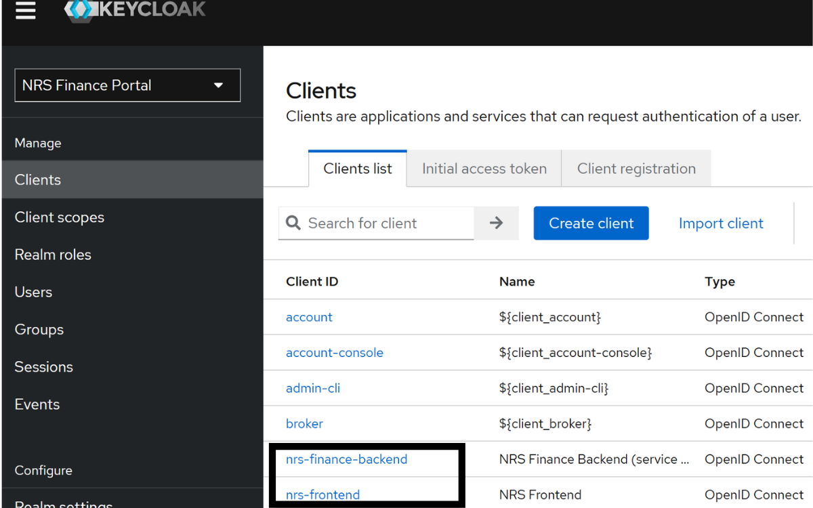

<p align="center">
  
</p>

<p align="center"><strong>Languages / Diller:</strong> <a href="keycloak-bootstrap.md">English</a> · <a href="keycloak-bootstrap.tr.md">Türkçe</a></p>

---

# Keycloak bootstrap (yerel Docker)

Bu rehber, **Docker Compose** yığınında Keycloak'ın nasıl hazırlandığını açıklar. [`docs/security/README.tr.md`](../security/README.tr.md) ile birlikte okuyun.

---

## `docker compose up` sırasında ne olur?

[`docker-compose.yml`](../../docker-compose.yml) içindeki `keycloak` servisi şu komutu çalıştırır:

```text
command: start-dev --import-realm
```

İlk açılışta (veya Keycloak volume boşken) şu dosya import edilir:

| Dosya | Amaç |
|-------|------|
| [`infra/keycloak/import/nrs-finance-realm.json`](../../infra/keycloak/import/nrs-finance-realm.json) | `nrs-finance` realm'i, client'lar, roller, demo kullanıcılar |

Compose yorum referansı: `docs/ops/keycloak-bootstrap.md`

---

## Realm özeti

| Öğe | Değer |
|-----|-------|
| Realm adı | `nrs-finance` |
| Görünen ad | NRS Finance Portal |
| Frontend client | `nrs-frontend` |
| Backend admin / S2S client | `nrs-finance-backend` |
| Keycloak UI self-registration | **Kapalı** (`registrationAllowed: false`) |
| Portal kaydı | Landing → `finance-service` `/api/public/register` |

Kayıt ve şifre sıfırlama e-postaları **Keycloak SMTP ile gönderilmez**. Gmail OAuth + `notification-service` kullanılır — bkz. [`docs/email-setup.tr.md`](../email-setup.tr.md).

---

## Demo hesaplar (realm import)

Yerel değerlendirme için import edilen kullanıcılar:

| Kullanıcı adı | Şifre | Rol | Not |
|---------------|-------|-----|-----|
| `nrsadmin` | `123456789` | ADMIN | Admin menüsü, audit, kullanıcı yönetimi |
| `testuser` | `123456789` | USER | Dashboard, piyasa, portföy, simülasyon |

> **Yalnızca yerel geliştirme.** Canlı ortamda demo şifreleri değiştirin veya kaldırın.

---

## Keycloak admin console

| Öğe | Değer |
|-----|-------|
| URL | http://localhost:8081 |
| Admin kullanıcı | `.env` → `KEYCLOAK_ADMIN` (varsayılan `admin`) |
| Admin şifre | `.env` → `KEYCLOAK_ADMIN_PASSWORD` (varsayılan `admin`) |

Realm ayarlarını, client'ları ve kullanıcıları incelemek için admin console kullanılabilir. Günlük kullanıcı işlemleri için portal admin API'leri tercih edilir.

---

## Volume davranışı

| Volume | Ad | Etki |
|--------|-----|------|
| `keycloak_data` | `nrs_keycloak_data` | Keycloak iç durumunu restart'lar arası saklar |

- **İlk çalıştırma:** realm JSON volume'a import edilir.
- **Sonraki çalıştırmalar:** mevcut volume kullanılır; her restart'ta realm tam yeniden uygulanmayabilir.
- **Tam sıfırlama:** `docker compose down -v` volume'ları siler; sonraki `up` realm JSON'u yeniden import eder.

---

## Production uyarısı

Compose yığını **`start-dev`** kullanır — **yalnızca yerel geliştirme** içindir:

- Production için sertleştirilmemiştir (HTTP, dev mode)
- Realm JSON **demo şifreler** içerir
- Import edilen realm'de `bruteForceProtected` **kapalı** (bkz. [`docs/security/README.tr.md`](../security/README.tr.md))
- Keycloak **SMTP yapılandırılmamış** — e-posta akışları Gmail + `notification-service` üzerinden gider

Production'da desteklenen Keycloak dağıtım modu, TLS, harici secret'lar ve demo kullanıcıların kaldırılması gerekir.

---

## Keycloak doğrulama

```powershell
docker compose ps keycloak
curl.exe http://localhost:8081/realms/nrs-finance/.well-known/openid-configuration
```

http://localhost:8081 → realm **nrs-finance** mevcut olmalı.

<p align="center">
  
</p>

---

[← Dokümantasyon merkezi](../README.tr.md) · [Güvenlik →](../security/README.tr.md) · [E-posta kurulumu →](../email-setup.tr.md)
