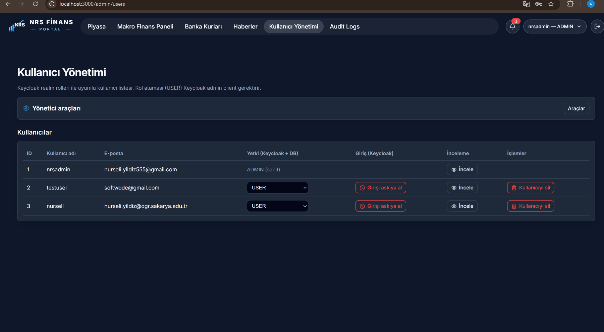

<p align="center">
  
</p>

<p align="center"><strong>Languages / Diller:</strong> <a href="README.md">English</a> · <a href="README.tr.md">Türkçe</a></p>

---

# Güvenlik — Keycloak, JWT, 2FA (TOTP)

NRS Finance Portal, servis yetkilendirmesi için **JWT** ile **Keycloak tabanlı kimlik doğrulama** ve isteğe bağlı **TOTP tabanlı 2FA** kullanır.

---

## Mimari özeti

<p align="center">
  
</p>

**Akış:** Frontend (`keycloak-js`) ↔ Keycloak giriş → JWT → API çağrıları `Bearer` ile → Spring Boot `issuer-uri` ve rol claim'leri ile doğrular.

---

## Keycloak yapılandırması

| Öğe | Değer |
|-----|-------|
| Docker URL | http://localhost:8081 |
| Realm | `nrs-finance` |
| Realm içe aktarma | `infra/keycloak/import/nrs-finance-realm.json` |
| Frontend istemcisi | `nrs-frontend` |
| Backend istemcisi | `nrs-finance-backend` (admin / S2S) |

Realm başlangıçta otomatik içe aktarılır (`start-dev --import-realm`).

### Yönetim konsolu

- URL: http://localhost:8081
- Kullanıcı adı: `.env` → `KEYCLOAK_ADMIN` (varsayılan `admin`)
- Parola: `.env` → `KEYCLOAK_ADMIN_PASSWORD`

---

## JWT akışı

1. Kullanıcı frontend'den giriş yapar.
2. Keycloak bir `access_token` (JWT) döndürür.
3. Frontend API çağrılarına `Authorization: Bearer <token>` ekler (Axios interceptor).
4. Backend servisleri `spring.security.oauth2.resourceserver.jwt.issuer-uri` ile imzayı doğrular.
5. Rol tabanlı erişim `@PreAuthorize` ve frontend route guard'ları ile uygulanır.

Örnek roller: `USER`, `ADMIN`

Backend: `SecurityConfig.java`  
Frontend: `auth/AuthContext.tsx`, `auth/RoleProtectedRoute.tsx`

---

## 2FA / TOTP

**Davranış:** Kullanıcılar TOTP'yi **Ayarlar → İki faktörlü kimlik doğrulama** üzerinden etkinleştirir. Varsayılan olarak isteğe bağlıdır; etkinleştirildikten sonra giriş OTP doğrulaması gerektirir.

### Bileşenler

| Katman | Dosya / servis |
|--------|----------------|
| API | `UserTotpController` — `/api/v1/users/me/totp` |
| Servis | `UserTotpService`, `UserTotpCredentialStore` (Redis) |
| Giriş | `PublicLoginService` — portal TOTP veya Keycloak OTP |
| Keycloak | `KeycloakTotpLoginPolicyService`, `CONFIGURE_TOTP` eylemi |
| Frontend | `SettingsTwoFactorCard.tsx`, `totpApi.ts` |

### Kütüphane

`dev.samstevens.totp` — TOTP üretimi/doğrulaması

### Ortam değişkenleri

```env
KEYCLOAK_SECURITY_OTP_ENFORCEMENT_ENABLED=false   # varsayılan: isteğe bağlı 2FA
KEYCLOAK_SECURITY_REQUIRED_ACTION=CONFIGURE_TOTP
```

OTP zorunluluğu role göre yapılandırılabilir (`KEYCLOAK_SECURITY_ENFORCED_ROLES`).

---

## Beni hatırla ve oturum süreleri

Keycloak realm SSO ayarları `finance-service` tarafından senkronize edilebilir:

```env
KEYCLOAK_SECURITY_REMEMBER_ME_ENFORCEMENT_ENABLED=true
KEYCLOAK_SECURITY_SSO_IDLE=PT30M
KEYCLOAK_SECURITY_SSO_MAX=PT8H
KEYCLOAK_SECURITY_ACCESS_TOKEN_LIFESPAN=PT5M
```

---

## Servisler arası (S2S) güvenlik

`notification-service` → `finance-service` dahili API:

- Client credentials / S2S token
- `S2SAccessTokenService`, `KEYCLOAK_NOTIFICATION_S2S_SECRET`

---

## Genel endpoint'ler

Kayıt, giriş ve şifre sıfırlama JWT gerektirmez:

- `PublicRegistrationController` — `/api/public/register/**`
- `PublicLoginController` — `/api/public/login`, `/api/public/token/**`
- `PublicPasswordResetController` — `/api/public/password-reset/**` (e-posta OTP → Keycloak şifre güncelleme)

Şifre sıfırlama, kayıt ile aynı Gmail bildirim hattını kullanır (Keycloak SMTP değil). Kodlar Redis'te tutulur; yeniden gönderim 60 sn cooldown ile sınırlıdır.

Hız sınırlama: `RateLimitFilter` (Redis destekli)

Detay: [`email-setup.tr.md`](../email-setup.tr.md) (Gmail hattı, Keycloak SMTP değil)

---

## Admin giriş askıya alma

Admin, kullanıcı portal girişini askıya alabilir:

| Metot | Path | Etki |
|-------|------|------|
| POST | `/api/admin/users/{userId}/suspend-login` | `loginSuspended`, Keycloak `enabled=false`, isteğe bağlı `{ "reason" }` |
| POST | `/api/admin/users/{userId}/unsuspend-login` | Askıyı kaldırır |

- `AdminUserSuspensionController`, `UserLoginSuspensionService` (**ADMIN askıya alınamaz**; admin kendini askıya alamaz)
- `FrozenUserAccessFilter` — askılı kullanıcıda **403** `USER_LOGIN_SUSPENDED`
- Kafka `notification-events` — kullanıcı bilgilendirilir

Frontend: Admin → Users; askılı girişte landing banner (`?suspended=1`).

<p align="center">
  
</p>

---

## marketdata public okuma (JWT yok)

Piyasa terminali için `/api/market/**`, `/api/news/**`, `/api/viop/**` vb. birçok **GET** rotası **permitAll** (`marketdata/.../SecurityConfig.java`). Admin POST ve `/internal/**` için JWT **ADMIN** veya **OPS** gerekir.

---

## Production uyarıları (yerel Compose)

| Konu | Yerel demo |
|------|------------|
| Keycloak | `start-dev` — production değil — [`ops/keycloak-bootstrap.tr.md`](../ops/keycloak-bootstrap.tr.md) |
| Demo şifreler | Realm JSON'da `nrsadmin` / `testuser` |
| Brute force | Import realm'de `bruteForceProtected: false` |
| E-posta | Keycloak SMTP boş — Gmail + `notification-service` |
| Grafana | Audit gömüleri için anonim viewer açık olabilir (yerel) |

---

## Güvenlik duman kontrol listesi

- [ ] Keycloak :8081'de erişilebilir
- [ ] Giriş → JWT korumalı endpoint 200 döner
- [ ] JWT olmadan `/api/v1/users/me` 401 döner
- [ ] `USER` rolüyle admin sayfası 403 döner
- [ ] Ayarlarda 2FA etkinleştir → sonraki giriş OTP ister
- [ ] Swagger UI "Authorize" `Bearer <token>` ile çalışır
- [ ] (Gmail yapılandırıldıysa) Şifre sıfırlama: landing → Şifremi unuttum → tam akış
- [ ] (Admin) `testuser` askıya al → giriş engeli → unsuspend ile düzelir

---

[← Dokümantasyon merkezi](../README.tr.md)
