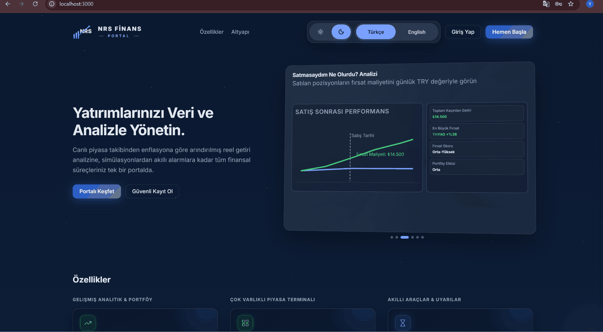
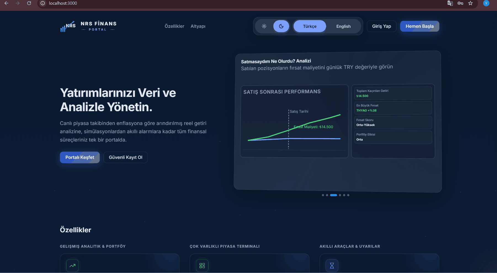
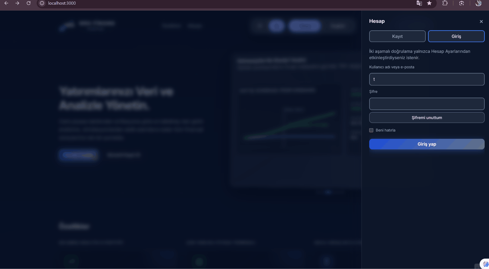
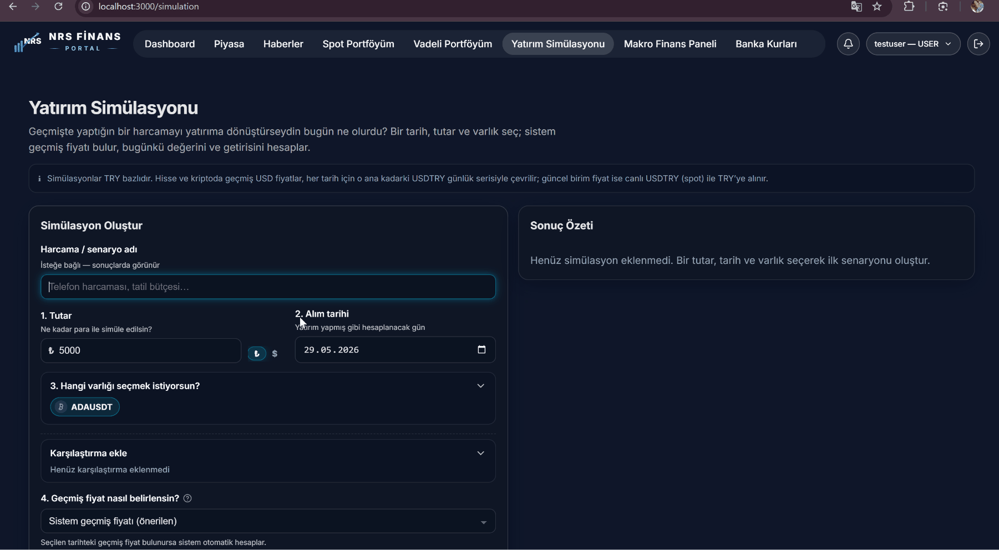

<p align="center">
  
</p>

<p align="center"><strong>Languages / Diller:</strong> <a href="README.md">English</a> · <a href="README.tr.md">Türkçe</a></p>

---

# Frontend — NRS Finance Portal

React 19 + TypeScript + Vite 7 single-page application.

---

## Summary

| Item | Value |
|---------|-------|
| **Framework** | React 19 |
| **Build** | Vite 7 |
| **State / data** | TanStack Query 5 |
| **Routing** | React Router 7 |
| **Auth** | keycloak-js 26 |
| **App URL (Docker stack)** | http://localhost:3000 |
| **Local port (optional)** | 5173 |

---

## Routes

| Path | Page | Description |
|------|-------|----------|
| `/` | Landing / redirect | Unauthenticated entry — **Register** and **Forgot password** live here (not separate routes) |
| `/login` | Login redirect | Keycloak login flow |
| `/dashboard` | Dashboard | Overview & KPIs |
| `/news` | News | Financial news feed (marketdata) |
| `/market` | Market terminal | Live quotes & charts |
| `/market/heatmap` | Heatmap | Sector heatmap |
| `/market/macro` | Macro | Inflation, rates, eurobonds |
| `/market/bank-rates` | Bank FX rates | Comparison table |
| `/portfolio` | Portfolio | Manual positions |
| `/portfolio/ai-analysis` | Portfolio AI | AI report (`OPENAI_API_KEY`) |
| `/simulation` | Simulation | Historical “what-if” scenarios |
| `/viop-bond-analysis` | VIOP / Bonds | Analysis & positions |
| `/notifications` | Notifications | In-app inbox |
| `/settings` | Settings | Profile, 2FA, notification prefs |
| `/admin/users` | Admin | User management (ADMIN) — suspend/unsuspend login |
| `/admin/audit` | Admin audit | Logs + Grafana embeds |

### Redirect routes (no dedicated page)

| Path | Redirects to |
|------|----------------|
| `/market/advanced` | `/market` |
| `/trade`, `/transactions`, `/wallet` | `/portfolio` |
| `/admin` | `/admin/users` |
| `/admin/accounts`, `/admin/settings`, `/admin/market-ops` | `/admin/users` |

**Landing flows (in-page, not routes):**

- **Register** — email verification via `finance-service` `/api/public/register` (needs `GMAIL_*`)
- **Forgot password** — Sign-in tab → email → code → new password via `/api/public/password-reset/*`

Route definitions: `src/App.tsx`, landing panel: `src/pages/LandingPage.tsx`

<p align="center">
  
</p>

<p align="center">
  
</p>

<p align="center">
  
</p>

<p align="center">
  
</p>

---

## Project structure

```
src/
├── api/              # Axios client, JWT interceptor, API versioning
├── auth/             # Keycloak, ProtectedRoute, RoleGuard
├── components/       # Domain UI (market, viopBond, macro, simulation, …)
├── pages/            # Route pages
├── services/         # Backend API calls
├── hooks/            # Shared React hooks
├── queries/          # TanStack Query cache keys
├── types/            # TypeScript types
├── i18n/             # TR / EN translations
├── theme/            # Dark/light theme
├── providers/        # QueryProvider
├── utils/ + lib/     # Utilities
├── App.tsx
└── main.tsx
```

---

## Run

### Docker Compose (recommended)

From the repo root (`.env` should set `COMPOSE_PROFILES=production` for nginx on port 3000):

```powershell
docker compose up -d --build
```

Open: http://localhost:3000

For Vite HMR: `COMPOSE_PROFILES=dev` in `.env`, or `docker compose --profile dev up -d` (do not enable `production` at the same time).

### Local (optional)

```powershell
cd frontend
npm ci
npm run dev
```

→ http://localhost:5173

> Keycloak redirect URIs are commonly configured for `http://localhost:3000/*`. If you use `:5173`, update the client redirect URIs in Keycloak accordingly.

---

## Environment variables

`VITE_*` variables are loaded from the repo root `.env` or `frontend/.env`.

| Variable | Default (Docker stack) |
|----------|-------------------|
| `VITE_API_URL` | http://localhost:8085 |
| `VITE_MARKET_API_URL` | http://localhost:8083 |
| `VITE_NOTIFICATION_API_URL` | http://localhost:8089 |
| `VITE_KEYCLOAK_URL` | http://localhost:8081 |
| `VITE_KEYCLOAK_REALM` | nrs-finance |
| `VITE_KEYCLOAK_CLIENT_ID` | nrs-frontend |
| `VITE_API_VERSION` | v1 |

Grafana embeds (Admin Audit): `VITE_GRAFANA_*` (see `docker-compose.yml`).

---

## Commands

```powershell
npm run dev      # Local development server
npm run build    # Production build → dist/
npm run lint     # ESLint
npm test         # Vitest unit tests
npm run preview  # Preview the production build
```

---

## Test

Vitest tests live under `src/**/*.test.ts` (examples):

- Calculations: `viopBondCalculations`, `marketPurchasingPower`
- API: `apiVersion`, `macroRatesApi`

```powershell
npm test
```

Component/E2E tests are currently out of scope (backend-heavy testing strategy).

---

## Production image

`frontend/Dockerfile` serves the static `dist/` via nginx.

The Docker stack is the recommended way to run the UI end-to-end with Keycloak and backend services.

---

## Documentation

- [Root README](../README.md)
- [Security (Keycloak)](../docs/security/README.md)
- [API](../docs/api/README.md)
