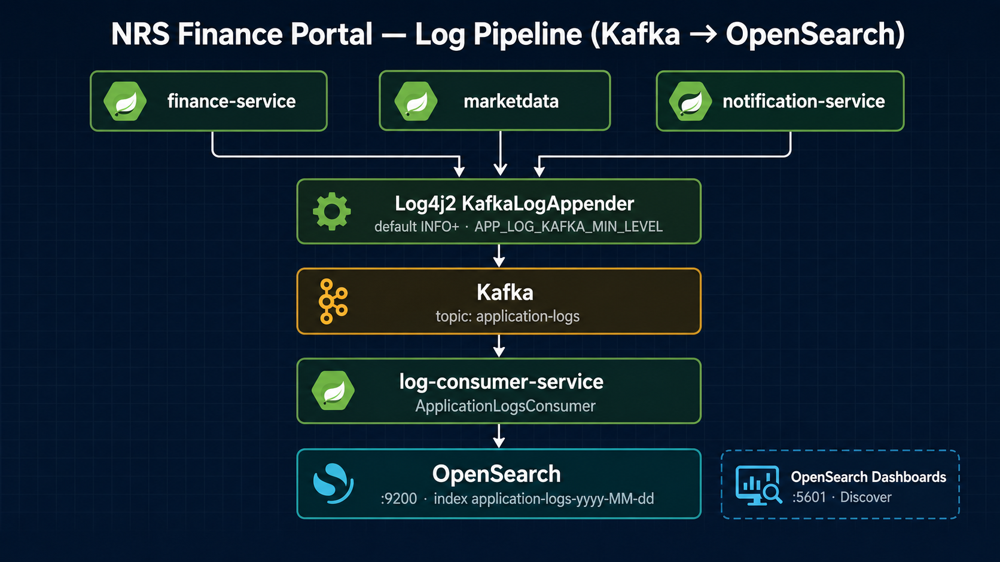

<p align="center">
  
</p>

<p align="center"><strong>Languages / Diller:</strong> <a href="README.md">English</a> · <a href="README.tr.md">Türkçe</a></p>

---

# log-consumer-service

Kafka log consumer service — indexes application logs into OpenSearch (logging pipeline requirement).

---

## Summary

| Item | Value |
|---------|-------|
| **Java** | 21 |
| **Spring Boot** | 3.5.5 |
| **Docker port** | 8087 |
| **Local port** | 8090 |
| **Swagger** | http://localhost:8087/swagger-ui.html |

---

## Responsibilities

1. **Consume application logs** from Kafka topic `application-logs`
2. **Index logs into OpenSearch** using daily indices: `application-logs-yyyy-MM-dd`
3. Ensure index initialization/templates exist (daily rollover pattern)
4. (Optional) additional consumers for transaction/event streams if enabled

---

## Data flow

<p align="center">
  
</p>

Minimum level forwarded to Kafka: **`APP_LOG_KAFKA_MIN_LEVEL=INFO`** (default). Set `WARN` to reduce volume. Same as [`docs/observability/README.md`](../docs/observability/README.md).

---

## Dependencies

| Component | Purpose |
|---------|------|
| Kafka | Log event source |
| OpenSearch | Log storage + search |
| Redis | Optional dedup/cache (if configured) |

---

## Run

### Docker Compose

```powershell
docker compose up -d log-consumer-service
```

Kafka and OpenSearch must be up (Docker Compose brings them up when running the full stack).

Service URL: http://localhost:8087  
Health: http://localhost:8087/actuator/health

---

## Verify

```powershell
curl http://localhost:8087/actuator/health
curl "http://localhost:9200/_cat/indices?v" | findstr application-logs
```

You should see indices like `application-logs-YYYY-MM-DD` after the first logs are produced.

Tip: generate some traffic from the UI, then query a few docs:

```powershell
curl "http://localhost:9200/application-logs-*/_search?size=3&pretty"
```

Integration test: `ApplicationLogsFlowIntegrationTest` — end-to-end Kafka → OpenSearch.

---

## Test

CI: `mvn test -pl log-consumer-service`

---

## Environment variables (Docker)

```env
SPRING_KAFKA_BOOTSTRAP_SERVERS=nrs-kafka:9093
OPENSEARCH_HOST=nrs-opensearch
OPENSEARCH_PORT=9200
```

Common overrides:

| Variable | Purpose |
|----------|---------|
| `SPRING_KAFKA_BOOTSTRAP_SERVERS` | Kafka broker used by the consumer |
| `OPENSEARCH_HOST` / `OPENSEARCH_PORT` | OpenSearch target |

---

## Troubleshooting

<details>
<summary><strong>No indices are being created</strong></summary>

- Verify Kafka and OpenSearch are reachable from the container
- Check consumer logs:

```powershell
docker compose logs -f log-consumer-service
```

</details>

<details>
<summary><strong>OpenSearch is up but searches return 0 hits</strong></summary>

- Ensure upstream services are actually sending logs to Kafka (Log4j2 Kafka appender enabled)
- Generate traffic (open UI pages / call APIs), then retry:

```powershell
curl "http://localhost:9200/application-logs-*/_search?size=3&pretty"
```

</details>

---

## Documentation

- [Observability](../docs/observability/README.md)
- [Root README](../README.md)
